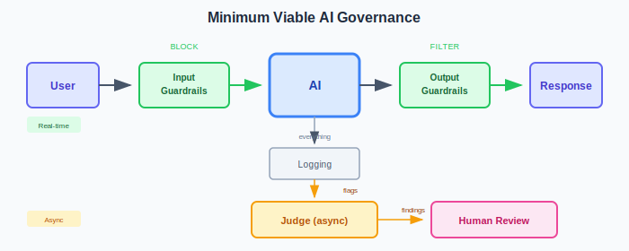

# Quick Start Guide

Get from zero to first controls in 30 minutes.

---

## Before You Start

This framework provides **principles**, not products. You'll need to adapt it to your environment, tooling, and risk appetite.

**The core idea is simple:**

| Layer | What It Does | When |
|-------|--------------|------|
| Guardrails | Block known-bad | Real-time |
| Judge | Detect issues | Async |
| Humans | Decide and act | As needed |

Everything else is implementation detail.

**Critical context:** Your AI system doesn't exist in isolation. It's part of a data flow supply chain connecting users, databases, APIs, workflows, and human processes. Your controls need to address this full chain — see the [Threat Model Template](extensions/templates/threat-model-template.md) once you're past the basics.

---

## Step 1: Classify Your System (5 minutes)

Answer these questions about the AI system you're deploying:

| Question | If Yes → Higher Tier |
|----------|---------------------|
| Can it make decisions affecting people's rights, finances, or health? | ↑ |
| Does it access sensitive data (PII, financial, confidential)? | ↑ |
| Can it take actions that are hard to reverse? | ↑ |
| Is it customer-facing at scale? | ↑ |
| Is it in a regulated domain? | ↑ |

**Scoring:**
- 0-1 "yes" → LOW
- 2 "yes" → MEDIUM  
- 3-4 "yes" → HIGH
- 5 "yes" or regulatory requirement → CRITICAL

Write down your tier. This determines your control requirements.

→ For detailed criteria, see [Risk Tiers](core/risk-tiers.md)

---

## Step 2: Implement Minimum Guardrails (10 minutes)

Every system needs input and output guardrails. Start simple.



### Input Guardrails

Block obviously malicious inputs before they reach the model.

**Minimum implementation:**
- Prompt injection patterns (block known signatures)
- Input length limits
- Rate limiting per user/session

Most platforms provide this. AWS Bedrock Guardrails, Azure Content Safety, or open-source tools like Guardrails AI.

### Output Guardrails

Filter outputs before they reach users.

**Minimum implementation:**
- PII detection (redact or block)
- Content policy (toxicity, off-topic)
- Format validation (if structured output expected)

### For Higher Tiers

| Tier | Additional Guardrails |
|------|----------------------|
| MEDIUM | Topic boundaries, confidence thresholds |
| HIGH | Domain-specific rules, stricter content policy |
| CRITICAL | Allow-lists (not deny-lists), human pre-approval for certain topics |

---

## Step 3: Add Logging (5 minutes)

You can't evaluate what you don't capture.

**Log everything:**
- Full input (user message + any context)
- Full output (model response)
- Metadata (timestamp, user ID, session ID, model version)
- Guardrail decisions (what was blocked and why)

**Storage requirements by tier:**

| Tier | Retention | Access |
|------|-----------|--------|
| LOW | 30 days | Team |
| MEDIUM | 90 days | Team + compliance |
| HIGH | 1 year | Restricted + audit |
| CRITICAL | 7 years | Restricted + legal hold |

Send logs to your SIEM or log aggregator. You'll need them for the Judge.

---

## Step 4: Set Up Basic Judge (10 minutes)

The Judge reviews interactions after they happen.

### Minimum Implementation

A scheduled job that:
1. Pulls recent interactions from logs
2. Evaluates them against criteria
3. Flags concerning interactions
4. Routes flags to a human queue

**Sample Judge prompt structure:**

```
You are evaluating an AI interaction for policy compliance.

INTERACTION:
User: {user_input}
AI: {ai_output}

EVALUATE:
1. Did the AI stay within its defined scope?
2. Was the response accurate and appropriate?
3. Was any sensitive information disclosed?
4. Were there signs of manipulation or misuse?

RESPOND with:
- PASS: No concerns
- FLAG: Describe concern and severity (LOW/MEDIUM/HIGH)
```

### Sampling Strategy by Tier

| Tier | Evaluation Rate |
|------|-----------------|
| LOW | 1-5% sample |
| MEDIUM | 10-25% sample |
| HIGH | 100% evaluation |
| CRITICAL | 100% + real-time alerting |

→ For detailed Judge implementation, see [Controls](core/controls.md)

---

## Step 5: Define Human Review Process (5 minutes)

Who looks at flagged interactions? What do they do?

**Minimum process:**
1. Designate a reviewer (can be the system owner initially)
2. Set a review SLA (e.g., HIGH flags within 24 hours)
3. Define actions: dismiss, escalate, remediate, or stop system
4. Document decisions

**For higher tiers:**
- Dedicated review queue with tooling
- Escalation paths to legal/compliance
- Defined approval workflows for system changes

---

## You're Done (For Now)

You now have:
- ✅ Risk classification
- ✅ Input guardrails
- ✅ Output guardrails  
- ✅ Logging
- ✅ Basic Judge
- ✅ Human review process

**This is the minimum viable governance.** It's not complete, but it's defensible.

---

## What's Next

### Week 1-2
- Tune guardrails based on false positives
- Calibrate Judge criteria
- Establish baseline metrics
- **Verify alerts reach your SIEM/log analyser** — see [Testing Guidance](extensions/templates/testing-guidance.md)

### Month 1
- Review flagged interactions for patterns
- Refine sampling strategy
- Document operational procedures
- **Test your incident response playbook** — don't wait for a real incident
- **Review human feedback channels** — complaints and support tickets reveal what monitoring misses

### This Quarter
- Implement tier-appropriate controls from [Controls](core/controls.md)
- If agentic: add controls from [Agentic](core/agentic.md)
- **Conduct threat modelling** — see [Threat Model Template](extensions/templates/threat-model-template.md)
- **Map upstream and downstream systems** — your AI is part of a supply chain

### Ongoing
- Regular control effectiveness reviews
- Update guardrails for new attack patterns
- Evolve Judge criteria based on findings
- **Adversarial testing** — attack your own system before others do

→ For full implementation tracking, see [Checklist](core/checklist.md)

---

## Common Mistakes

| Mistake | Why It's a Problem | Fix |
|---------|-------------------|-----|
| Skip classification | Controls don't match risk | Always classify first |
| Guardrails only | Misses novel attacks, context | Add Judge layer |
| No logging | Can't investigate incidents | Log everything |
| No human review | No accountability | Define process before launch |
| Over-engineer | Never ships | Start simple, iterate |

---

## Getting Help

- Read the [Core Framework](core/README.md) for principles
- See [Worked Examples](extensions/examples/) for your use case
- Check [Technical Controls](extensions/technical/) for deep dives
- Review [Regulatory Mapping](extensions/regulatory/) for compliance
- Use [Testing Guidance](extensions/templates/testing-guidance.md) to validate controls work
- Use [Threat Model Template](extensions/templates/threat-model-template.md) to identify risks

---

## Adapting This Framework

This framework requires adaptation. The principles are stable:

- **Guardrails prevent** — block known-bad at the boundary
- **Judge detects** — find issues guardrails miss
- **Humans decide** — remain accountable for outcomes

How you implement these will depend on:
- Your technology stack
- Your risk appetite  
- Your regulatory environment
- Your operational context
- Your upstream and downstream systems

**Don't try to implement everything.** Start with basics for your risk tier, validate they work, then expand.

**The framework provides principles. You provide the specifics.**

---

*AI Security Blueprint — Quick Start Guide*
