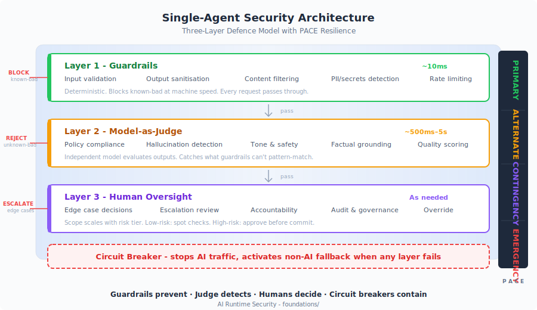

# AI Runtime Behaviour Security

> You tested your AI before deployment. You proved it worked. Then it hallucinated a medical dosage, leaked customer data, or approved a transaction it shouldn't have.

Traditional security assumes deterministic systems — same input, same output, testable, provable. AI isn't deterministic. The same prompt produces different responses every time. Your test suite proves the system *can* behave correctly. It cannot prove it *will* on the next request.

**This is a thinking tool** — not a product, not a vendor pitch, not a compliance checklist. It's an open-source framework for reasoning about what controls your AI systems actually need, given your threat model, risk appetite, and regulatory context. Two organisations reading this should arrive at different implementations, because they have different contexts. That's the point.

173 controls. 10 real incidents mapped. 8 standards aligned. MIT licensed.

---

## The Problem You're Solving

You can't fully test an AI system before deployment. The input space is natural language — effectively infinite. Emergent behaviour can't be predicted through conventional test suites. And adversarial inputs will find edge cases no QA team imagined.

So how do you know it's working correctly in production?

Most enterprise "AI security" today is guardrails: input/output filters that block known-bad patterns. That catches what you can define in advance. It doesn't catch the response that's fluent, confident, and wrong. The recommendation based on hallucinated data. The action that's technically authorised but contextually dangerous.

**You need layered runtime controls — not just faster pattern matching.**

---

## The Architecture

The industry is converging on the same answer independently. NVIDIA NeMo, AWS Bedrock, Azure AI, LangChain, Guardrails AI — all implement variants of the same pattern:

| Layer | What It Does | Speed |
| --- | --- | --- |
| **Guardrails** | Block known-bad inputs and outputs — PII, injection patterns, policy violations | Real-time (~10ms) |
| **LLM-as-Judge** | Detect unknown-bad — an independent model evaluating whether responses are appropriate | Async (~500ms–5s) |
| **Human Oversight** | Decide genuinely ambiguous cases that automated layers can't resolve | As needed |
| **Circuit Breaker** | Stop all AI traffic and activate a safe fallback when controls themselves fail | Immediate |

**Guardrails prevent. Judge detects. Humans decide. Circuit breakers contain.**

Each layer catches what the others miss. Remove any layer and you have a gap. The framework pairs every control with a **[PACE resilience architecture](PACE-RESILIENCE.md)** — Primary, Alternate, Contingency, Emergency — so when a layer degrades, the system transitions to a predetermined safe state rather than failing silently.



---

## Who This Is For

!!! tip "If you recognise your situation below, this framework was built for you."

**Security leaders** writing an AI security strategy and finding that existing frameworks describe what should be true without specifying how to make it true in production.
**→** [Security Leaders view](stakeholders/security-leaders.md) | [Risk & Governance view](stakeholders/risk-and-governance.md)

**Architects** working out where controls go in the AI pipeline, what they cost, and what happens when they fail.
**→** [Enterprise Architects view](stakeholders/enterprise-architects.md) | [Quick Start](QUICK_START.md) — zero to working controls in 30 minutes

**Engineers** building AI systems who want implementation patterns, not slide decks. Guardrail configs, Judge prompts, integration code.
**→** [AI Engineers view](stakeholders/ai-engineers.md) | [Integration Guide](maso/integration/integration-guide.md) — LangGraph, AutoGen, CrewAI, Bedrock

---

## Start Here

| I want to... | Go to |
| --- | --- |
| **Get started in 30 minutes** | **[Quick Start](QUICK_START.md)** — from zero to working controls |
| **Secure a single-model AI system** | **[Foundation Framework](foundations/)** — 80 controls, risk tiers, PACE resilience |
| **Secure a multi-agent system** | **[MASO Framework](maso/)** — 93 controls, 6 domains, 3 tiers |
| **Deploy low-risk AI fast** | **[Fast Lane](FAST-LANE.md)** — self-certification for internal, read-only, no regulated data |

<details>
<summary><strong>Common questions</strong> — cost, Judge reliability, supply chain, human factors, compliance</summary>

<br>

| I'm asking about... | Start here |
| --- | --- |
| What these controls cost and how to manage latency | [Cost & Latency](extensions/technical/cost-and-latency.md) — sampling strategies, latency budgets, tiered evaluation cascade |
| What happens when the Judge is wrong | [Judge Assurance](core/judge-assurance.md) — accuracy metrics, calibration, adversarial testing, fail-safe mechanisms |
| How the Judge can be attacked | [When the Judge Can Be Fooled](core/when-the-judge-can-be-fooled.md) — output crafting, judge manipulation, mitigations by tier |
| Securing the AI supply chain | [Supply Chain Controls](maso/controls/supply-chain.md) — AIBOM, signed manifests, MCP vetting, model provenance |
| Human operator fatigue and automation bias | [Human Factors](strategy/human-factors.md) — skill development, alert fatigue, challenge rate testing |
| Risks that emerge when agents collaborate | [Emergent Risk Register](maso/controls/risk-register.md) — 33 risks across 9 categories, with coverage assessment |

</details>

<details>
<summary><strong>More paths</strong> — risk classification, red teaming, strategy, worked examples</summary>

<br>

| I want to... | Start here |
| --- | --- |
| Get the one-page reference | [Cheat Sheet](CHEATSHEET.md) — classify, control, fail posture, test |
| Classify a system by risk | [Risk Tiers](core/risk-tiers.md) |
| Quantify AI risk for board reporting | [Risk Assessment](core/risk-assessment.md) |
| Align AI with business strategy | [From Strategy to Production](strategy/) |
| See the entire framework on one map | [Tube Map](TUBE-MAP.md) |
| Understand PACE resilience | [PACE Methodology](PACE-RESILIENCE.md) |
| Run adversarial tests on agents | [Red Team Playbook](maso/red-team/red-team-playbook.md) |
| Implement in LangGraph, AutoGen, CrewAI, or Bedrock | [Integration Guide](maso/integration/integration-guide.md) |
| See one transaction end-to-end with every log event | [Runtime Telemetry Reference](extensions/technical/runtime-telemetry-reference.md) |
| Enforce controls at infrastructure level | [Infrastructure Controls](infrastructure/) |
| See real incidents mapped to controls | [Incident Tracker](maso/threat-intelligence/incident-tracker.md) |
| See MASO applied in finance, healthcare, or energy | [Worked Examples](maso/examples/worked-examples.md) |
| Navigate by role | [Framework Map](FRAMEWORK-MAP.md) |
| Understand what's validated and what's not | [Maturity & Validation](MATURITY.md) |
| Map to compliance requirements | [Compliance & Legal view](stakeholders/compliance-and-legal.md) |
| See all references and further reading | [References & Sources](REFERENCES.md) |

</details>

---

## When Agents Talk to Agents

Single-model controls assume one AI, one context window, one trust boundary. Multi-agent systems break every one of those assumptions.

When multiple LLMs collaborate, delegate, and take autonomous actions, new failure modes emerge that single-agent frameworks don't address:

- **Prompt injection propagates** across agent chains — one poisoned document becomes instructions for every downstream agent
- **Hallucinations compound** — Agent A hallucinates a claim, Agent B cites it as fact, Agent C elaborates with high confidence
- **Delegation creates transitive authority** — permissions transfer implicitly through delegation chains nobody designed
- **Failures look like success** — the most dangerous outputs are well-formatted, confident, unanimously agreed, and wrong

The **[MASO Framework](maso/)** extends the foundation into multi-agent orchestration: 93 controls across 6 domains, 3 implementation tiers (supervised → managed → autonomous), full OWASP coverage for both LLM and Agentic top 10s, plus 30 emergent risks that have no OWASP equivalent — including epistemic failures like groupthink and synthetic corroboration that no other framework formally addresses.

**→ [Enter MASO](maso/)**

---

## Strategy: From Ideas to Running Systems

Security controls answer *how to secure* AI. They don't answer *what to build*, *whether AI is the right tool*, or *whether the organisation can deliver and operate it safely*.

The **[From Strategy to Production](strategy/)** section bridges this gap:

| Stage | Question | Output |
| --- | --- | --- |
| [Business Alignment](strategy/business-alignment.md) | Is this worth doing? Is AI the right tool? | Business case with alternatives assessed |
| [Use Case Definition](strategy/use-case-definition.md) | What exactly will it do? | Ten-question definition that feeds risk classification |
| [Risk Classification](core/risk-tiers.md) | What tier? What controls? | Six-dimension scored profile with governance approval |
| [From Idea to Production](strategy/idea-to-production.md) | How do we get from idea to safe operation? | Eight-stage lifecycle with gates and owners |

Three constraints strategies routinely underestimate: **[Data Reality](strategy/data-reality.md)** — your data determines your strategy more than your ambition does. **[Human Factors](strategy/human-factors.md)** — controls don't work if the people operating them aren't ready. **[Progression](strategy/progression.md)** — moving from low to high risk takes 2–3 years; skipping steps is the most common strategic failure.

---

## Standards Alignment

| Standard | Coverage |
| --- | --- |
| [OWASP LLM Top 10 (2025)](https://owasp.org/www-project-top-10-for-large-language-model-applications/) | Full mapping across foundation + MASO |
| [OWASP Agentic Top 10 (2026)](https://genai.owasp.org/) | Full mapping in MASO |
| [NIST AI RMF](https://www.nist.gov/itl/ai-risk-management-framework) | Govern, Map, Measure, Manage |
| [ISO 42001](https://www.iso.org/standard/81230.html) | AI management system alignment |
| [NIST SP 800-218A](https://csrc.nist.gov/pubs/sp/800/218/a/final) | Pre-deployment complement |
| [MITRE ATLAS](https://atlas.mitre.org/) | Agent-focused threat intelligence |
| [EU AI Act](https://artificialintelligenceact.eu/) | Art. 9, 14, 15 — risk management, oversight, robustness |
| [DORA](https://www.digital-operational-resilience-act.com/) | Digital operational resilience for financial services |

---

## About This Framework

<details>
<summary><strong>What it provides, what it doesn't, and how to use it</strong></summary>

<br>

**What it provides:**

- **A way of thinking about controls, not a prescription for them.** The framework describes *what* needs to be true and *why* it matters. It does not mandate a specific product, vendor, or architecture. If your existing tools already satisfy a control, you don't need new ones.
- **Help deciding where to invest.** Not every control matters equally. Risk tiers, PACE resilience levels, and the distinction between foundation and multi-agent controls exist so you can reason about priority.
- **Defence in depth as a design principle.** The layered approach exists because each layer covers gaps in the others. The question isn't "which layer do we need?" but "what happens when each layer fails?"
- **Resilience thinking for AI products.** Traditional security asks "how do we prevent bad things?" This framework also asks "what happens when prevention fails?"
- **Clarity on when tools are *not* needed.** Some controls are already handled by your existing infrastructure. The framework should help you see where you already have coverage, not convince you to buy something new.

**What it is not:**

- Not a certification or audit standard. You cannot be "compliant with" this framework.
- Not a product recommendation. Tool and vendor references are illustrative, not endorsements.
- Not a substitute for professional security assessment of your specific deployment.
- Not a finished document. AI security is moving fast. This framework will evolve as the landscape does.

</details>

---

## Repository Structure

<details>
<summary><strong>Expand to see the full repository layout</strong></summary>

<br>

```
├── README.md                          # This document — start here
├── TUBE-MAP.md                        # Complete framework tube map with guide
├── foundations/
│   └── README.md                      # Single-model AI security framework
├── maso/
│   ├── README.md                      # Multi-Agent Security Operations
│   ├── controls/                      # 6 domain specifications + risk register
│   ├── implementation/                # 3 tier guides (supervised, managed, autonomous)
│   ├── threat-intelligence/           # Incident tracker + emerging threats
│   ├── red-team/                      # Adversarial test playbook (13 scenarios)
│   ├── integration/                   # LangGraph, AutoGen, CrewAI, AWS Bedrock patterns
│   └── examples/                      # Financial services, healthcare, critical infrastructure
├── stakeholders/                      # Role-based entry points (security, risk, architecture, product, engineering, compliance)
├── images/                            # All SVGs (tube map, architecture, OWASP coverage, stakeholder map)
├── core/                              # Risk tiers, controls, IAM governance, checklists
├── infrastructure/                    # 80 technical controls, 11 domains
├── extensions/                        # Regulatory, templates, worked examples
├── insights/                          # Analysis articles and emerging challenges
└── strategy/                          # AI strategy — alignment, data, human factors, progression
```

</details>

---

## About the Author

**Jonathan Gill** is a cybersecurity practitioner with over 30 years in information technology and 20+ years in enterprise cybersecurity. His career spans UNIX system administration, building national-scale ISP infrastructure, enterprise security architecture at major financial institutions, and diplomatic IT service.

His current focus is AI security governance: designing control architectures that address the unique challenges of securing non-deterministic systems at enterprise scale, and translating complex technical risk into actionable guidance for engineering teams and executive leadership.

- GitHub: [@JonathanCGill](https://github.com/JonathanCGill)
- LinkedIn: [Jonathan Gill](https://www.linkedin.com/in/jonathancgill/)

---

## Disclaimer

This framework is provided as-is under the [MIT License](LICENSE). As described in [About This Framework](#about-this-framework), it is a thinking tool — not a standard, certification, or guarantee of security. It reflects one practitioner's synthesis of industry patterns, regulatory requirements, and operational experience.

If you adopt any part of this framework, you are responsible for validating it against your own threat model, environment, and regulatory obligations.

This framework was written with AI assistance (Claude and ChatGPT) for drafting, structuring, and research synthesis. Architecture, control design, risk analysis, and editorial judgment are the author's.

This is a personal project. It is not affiliated with, endorsed by, or representative of any employer, organisation, or other entity. The views and opinions expressed are the author's own and should not be construed as reflecting the position or policy of any company or institution with which the author is or has been associated.

---

*AI Runtime Behaviour Security, 2026 (Jonathan Gill).*
