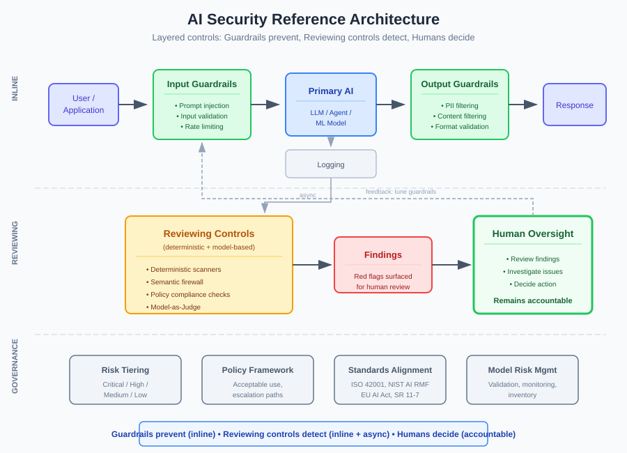

# AI Runtime Security

**AI Governance decides what AI should do. AI Runtime Security verifies what it actually does.**

These are different questions, different tools, and different teams. Governance sets policy: what the model is allowed to do, who is accountable, what regulations apply. Runtime security enforces it: catching the prompt injection mid-request, evaluating outputs before they reach users, halting the agent that tries to exceed its scope.

Most organisations have governance. Few have runtime security. That gap is where the failures live.

AIRS is a vendor-neutral, risk-proportionate framework for the enforcement side: layered runtime controls you can match to your actual risk, not a compliance checklist.

**Three domains, one framework.** [Foundation](foundations/README.md) secures single-agent systems, [MASO](maso/README.md) secures multi-agent orchestration, and [Infrastructure](infrastructure/README.md) secures the platforms underneath.

New here? Start with [what AI Runtime Security is](what-is-ai-runtime-security.md).

{ .arch-diagram }

---

## The governance gap

**Governance asks:**

What is this AI allowed to do? Who is accountable when it fails? Does this deployment comply with policy and regulation?

*Answered by: policies, risk registers, accountability frameworks, audits, and compliance programmes.*

**Runtime security answers:**

Is it doing that, right now, in this request? Did the model stay in scope? What stopped the last injection?

*Answered by: guardrails, model evaluation, audit trails, human escalation paths, and circuit breakers.*

Governance without runtime security is intent without enforcement. Your policy says the model should not exfiltrate data. Runtime security is what actually stops it.

---

## Three Questions. Three Doors.

-   **How do I run AI securely?**

    Ship your first LLM feature with the controls that matter most. Seven controls, one checklist, one decision tree for whether you need to go deeper.

    [Start](start.md) · [AIRSLite](minimum-viable-airs.md) · [Quick Start](quick-start.md)

-   **How do I secure AI while it is running?**

    The framework itself: four independent control layers for single-agent systems, eleven control domains for multi-agent orchestration, PACE resilience for graceful degradation.

    [Core Controls](core/README.md) · [MASO](maso/README.md) · [Architecture](architecture.md)

-   **How do I get the most out of AI safely?**

    Role-specific entry points. Each page tells you what matters for your role, why, where to start reading, and what you can do on Monday morning.

    [For Your Role](stakeholders/README.md)

---

## Find Your Role

Nine role-specific entry points. Each one frames AI runtime security through the lens of a single job, with a starting path, Monday-morning actions, and answers to the pushback you will get.

-   **[Security Leaders](stakeholders/security-leaders.md)**

    *How do I secure AI when the threat model is unlike anything I've secured before?*

-   **[Risk & Governance](stakeholders/risk-and-governance.md)**

    *How do I quantify AI risk and prove to the board that controls are working?*

-   **[Compliance & Legal](stakeholders/compliance-and-legal.md)**

    *How do I demonstrate that AI deployments meet regulatory obligations, with evidence?*

-   **[Insider Threat Teams](stakeholders/insider-threat-teams.md)**

    *Your programme already solves the problem AI agents create. How do you extend it?*

-   **[Chief Information Officers](stakeholders/chief-information-officers.md)**

    *How do I govern AI across my technology portfolio when every product runs different agents?*

-   **[Enterprise Architects](stakeholders/enterprise-architects.md)**

    *Where do controls go in my pipeline, what do they cost, and how do they fail?*

-   **[AI Engineers](stakeholders/ai-engineers.md)**

    *What do I actually build? Give me implementation patterns, not governance theory.*

-   **[Business Owners](stakeholders/business-owners.md)**

    *How do I manage AI risk across my product lines when agents are operational?*

-   **[Product Owners](stakeholders/product-owners.md)**

    *What controls are required to ship AI, and what do they cost in time and money?*

[All nine roles, grouped and explained](stakeholders/README.md)

---

## Framework at a Glance

| Layer | What It Covers | Entry Point |
|---|---|---|
| **Foundation** | Three-layer behavioural controls for single-agent deployments. 80 infrastructure controls across 11 domains. | [Architecture](architecture.md) |
| **MASO** | Ten control domains for multi-agent orchestration. PACE resilience. OWASP Agentic Top 10 coverage. | [MASO](maso/README.md) |
| **Implementation** | Platform patterns for AWS, Azure, Databricks. Tool access controls. Agentic infrastructure. | [Infrastructure](infrastructure/README.md) |

---

## Four Control Layers

A runtime control plane for AI behaviour. Each layer operates independently, and each can run in **detect-only** mode before you graduate it to **enforcing**. No single failure compromises the system.

-   **Guardrails**

    Fast, deterministic boundaries: content policies, scope constraints, tool-use permissions. Catches the obvious failures at machine speed. *~10ms per check.*

-   **Reviewing Controls**

    A combination of deterministic scanners, [a semantic firewall](core/controls/semantic-firewall.md), policy compliance checks, and Model-as-Judge evaluates outputs against policy, context, and intent before they reach users. Catches the subtle failures guardrails miss. *~5ms to 50ms inline, 500ms to 5s async by risk tier.*

-   **Human Oversight**

    Escalation paths, audit trails, and intervention capability for high-stakes decisions. Scope scales with consequence.

-   **Circuit Breakers**

    Emergency failsafes that halt AI operations and activate safe fallbacks when controls fail or compromise is confirmed.

[How the layers work together](what-is-ai-runtime-security.md) · [When is which reviewing control appropriate](architecture.md#when-is-which-reviewing-control-appropriate) · [End-to-end walkthrough: the Chevrolet $1 chatbot](walkthrough-chevrolet-1-dollar.md) · [Cost & latency by tier](extensions/technical/cost-and-latency.md)

---

## One idea underneath the layers

The four layers are *how* AIRS enforces. Underneath them is a single claim about *what* must hold, and it is the part we think keeps the framework from going stale every quarter.

**Most named agentic threats are one event wearing different labels:** untrusted content crossing a trust boundary and being treated as an instruction instead of as data. Goal hijack, memory poisoning, inter-agent compromise, poisoned skills, all structurally the same thing. Commit to one invariant and they collapse into a single enforcement problem rather than a growing list of separate ones.

- **Provenance is tagged at ingestion.** Untrusted content is marked as *data*, the tag persists across every hop, and data never self-promotes to instruction no matter what it says inside itself.
- **Match the checker to the flow.** A command on a constrained channel gets a cheap, deterministic **structural floor** (allowlist, port, protocol, schema) that no rephrased attack can fool. Content whose meaning is the risk gets the semantic firewall. You spend the expensive checks only where they earn their place.
- **Then test conformance.** Did the agent use the right commands for its task, and did the result match what was expected? Judged over the whole `(data, command, intent, output)` together, against the agent's declared intent, not against a denylist of this quarter's attacks.

Why it matters: when the next named attack arrives, the question stops being "which new control do we bolt on" and becomes "which part of this small core already covers it." A positive declaration of expected behaviour catches the novel attack by exclusion, because anything outside the declaration is suspect even before anyone has named the technique.

[The idea in full](core/controls/data-provenance-and-authority-boundaries.md) · [The OWASP Agentic Top 10 mapped to this core](core/controls/asi-top10-provenance-mapping.md)

---

## Insights

The *why* before the *how*. Each article identifies a specific problem that the controls then solve.

[Why guardrails aren't enough](insights/why-guardrails-arent-enough.md) · [The MCP problem](insights/the-mcp-problem.md) · [The orchestrator problem](insights/the-orchestrator-problem.md) · [What works](insights/what-works.md) · [All insights](insights/README.md)

---

## Related

-   **AI Secured by Design**

    Shifts security left, embedding it into AI systems from the start rather than bolting it on after deployment.

    [aisecuredbydesign.io](https://aisecuredbydesign.io/)

-   **MASO Learning Site**

    Structured guides, walkthroughs, and practical examples for the Multi-Agent Security Operations framework.

    [airuntimesecurity.co.za](https://airuntimesecurity.co.za)

---

Created by [Jonathan Gill](https://www.linkedin.com/in/jonathancgill/) · [feedback@airuntimesecurity.io](mailto:feedback@airuntimesecurity.io)

Last updated: June 2026

