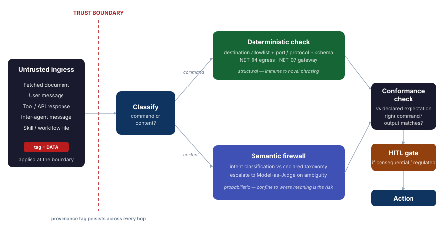

# Data Provenance and Authority Boundaries

Most of the named threats in agentic AI are one event wearing different labels: untrusted content crossing a trust boundary and being treated as an instruction rather than as data. A poisoned skill file, an injected email, a manipulated tool response, a corrupted inter-agent message: structurally identical. Something that should have stayed inert payload was interpreted as a command.

This page states the invariant that collapses those separate detection problems into one enforcement principle, and then the rule for choosing the **right checker** at each boundary. The layered controls (Guardrails, [Semantic Firewall](semantic-firewall.md), [Model-as-Judge](../controls.md), Human Oversight) are *how* you enforce this. The invariant is *what* must hold, regardless of what this quarter's attack is called.

## The invariant

Three properties must hold everywhere data moves:

1. **Provenance is tagged at ingestion, not at the point of use.** Every input crossing a boundary (user input, tool output, retrieved document, inter-agent message, skill instruction) is tagged at the boundary with where it came from and what authority it carries. Untrusted external content is tagged as **data**, permanently.
2. **Data never self-promotes to instruction.** A piece of tagged-as-data content cannot upgrade itself to instruction status no matter what it says inside itself. `ignore previous instructions` is just more tagged data, semantically inert to the orchestrator regardless of its content.
3. **Authority transitions are checked, not content.** The dangerous moment is the *next* hop, when something reads tagged data and decides what to do next. The check is on the transition: did the authority level of the action now happening match the authority of what triggered it? If a fetched document (data, untrusted) is immediately followed by a tool call that was not in the plan (a new instruction, elevated authority), that is the signature, regardless of what the document said or how it was phrased.

Implement provenance tagging once, and goal hijack, memory poisoning, inter-agent compromise, and a chunk of the skills supply-chain problem stop being separate problems for your architecture even when they keep getting separate names.

## Matching the checker to the flow

The invariant says what must hold. It says nothing about *how* to check it at a given boundary, and that is where proportionality lives. Part of what moves between systems is a **command**: a tool call, an MCP invocation, an egress request, an agent-to-agent RPC. A command has a structural risk surface (destination, protocol, port, parameters, asserted authority) that a deterministic check covers cheaply and without being fooled by phrasing.

But commands do not arrive on a clean, separate wire. They are **embedded in data**. The agent reads data, forms an intent, selects a command, and produces an output. Data, command, intent and output are one unit, and a structural check sees only one corner of it. A command can be perfectly valid structurally (allowlisted destination, correct port, valid schema) and still be the wrong command for the task, or one triggered by poisoned data, or one whose output does not match what was expected. So the deterministic check is a **necessary floor, not the verdict**.

{ .arch-diagram }

### The structural floor

Match the cheapest sufficient check to each flow's structural risk. This is the floor every flow must clear before anything more expensive runs.

| Flow type | Where the risk lives | Optimum checker | Why it is resilient to industry change |
|---|---|---|---|
| **Command on a constrained channel** (tool call, MCP, egress, A2A RPC) | destination, port, protocol, parameters, asserted authority | Deterministic: destination allowlist + port / protocol validation + parameter schema ([NET-04](../../infrastructure/controls/network-and-segmentation.md#net-04-agent-egress-controls), [NET-07](../../infrastructure/controls/network-and-segmentation.md#net-07-api-gateway-as-single-entry-point)) | Reasons about structure, never content. A new jailbreak phrasing does nothing to it. |
| **Natural-language content** (user message, fetched document, NL inter-agent message) | meaning / intent | [Semantic firewall](semantic-firewall.md), escalate to Judge only on ambiguity | Catches paraphrase and obfuscation, but is probabilistic and degrades against phrasing engineered to sit just outside the exemplar space. |
| **Either, when the action is consequential or regulated** | real-world effect | add a HITL gate regardless of the above | Compliance posture: GDPR Art 22, EU AI Act high-risk, SR 11-7. |

A command that fails the floor is rejected outright, cheaply, and the rejection is immune to novel phrasing. A command that passes the floor is **not yet approved**. It still has to conform.

### The conformance test

Above the floor sits the question the floor cannot answer: did the agent do what it was supposed to do? This is judged over the whole tuple (data, command, intent, output) against the agent's **declared expectation**, its [objective intent](../../maso/controls/objective-intent.md) or OISpec. Two questions:

1. **Did the agent use the right commands for what it was expected to do?** Command-selection conformance. A structurally valid command that is not one this agent should issue for its declared task is a conformance failure, even though every port and schema checks out.
2. **Did the result match what was expected of the agent?** Output conformance. An output that does not match the expected shape, scope, or effect of the declared task is a conformance failure, even if no individual command looked wrong in isolation.

The authority-transition check (property 3 of the invariant) is the structural special case of this: a data-tagged input followed by an unplanned, elevated-authority command is a conformance failure you can often catch structurally. The two questions above are the general case, and they are what trajectory evaluation and the Judge exist to answer.

### Why this is the resilience property

Two durable anchors, working together.

The **structural floor** does not decay. "This command targets port 22, which is not on the declared allowlist for this agent" is true regardless of what the next named incident is called, what language the payload is in, or how it is phrased. Push as much enforcement as possible onto it, and confine semantic and trajectory evaluation to the flows that need them.

The **conformance test** is anchored on a positive declaration of expected behavior, not a denylist of attacks. A novel attack that pushes the agent outside its expected behavior is caught by exclusion: anything outside the declared expectation is suspect, even when no one has named the technique yet. Denylists chase this quarter's attack names. An expectation anchor does not, which is the resilience you are asking for (see [Containment Through Intent](../../insights/containment-through-intent.md)).

### The decision procedure

At every boundary, cheapest first:

1. **Structural floor.** Is this a command on a constrained channel? Validate deterministically (allowlist + port / protocol + schema). Fail closed. No semantic checker is needed to reject a structural violation.
2. **Content meaning.** Is this content whose meaning is the risk? Run the semantic firewall, escalate to the Judge only on ambiguity.
3. **Conformance.** Over the tuple (data, command, intent, output): did the agent use the right commands and produce the expected result, judged against its declared expectation? This is trajectory evaluation and the Judge.
4. **Consequence.** Is the resulting action consequential or regulated? Add HITL regardless of what passed above.

This reframes the layer stack from a fixed pipeline into a router: each flow clears the structural floor, then is dispatched to the minimum sufficient checker for its meaning and its conformance to expectation.

## The command channel requirement

A command is only cheaply and robustly checkable if the **channel is constrained enough to be checked deterministically**: declared verbs, declared destinations, declared ports, a parameter schema. This produces a hard requirement:

!!! warning "Commands must not ride inside content"
    Command channels (tool invocation, MCP, agent egress, agent-to-agent messaging) **must** be structured so the optimum checker is a deterministic protocol, port, destination, and schema validation. Commands smuggled inside free-form natural language force the expensive, fallible semantic checker to do work a port check could do deterministically, and they defeat the authority-transition check.

    Where an existing pattern cannot meet this yet (some MCP and tool integrations pass instructions as prose), the fallback is explicit and more costly by design: treat the channel as content, run the semantic firewall, **and** require a HITL gate for any action with real-world effect until the channel is constrained. The cost of the fallback is the incentive to fix the channel.

The constrained command channel is also what makes the authority-transition check affordable. "Did tagged-as-data content produce a new, unplanned, elevated-authority instruction?" is hard to answer if commands are smuggled in prose. It becomes a near-trivial structural observation once commands are a constrained protocol: a data-tagged input was followed by a command on the egress channel that was not in the plan.

## The compliance dividend

This is not only a cost optimisation, it is an audit artifact. For each data flow you can record: flow type, provenance tag, risk tier, the agent's declared expectation, checker chosen, why it is sufficient, the conformance result, and whether a HITL gate applies. That extends the [Control Selection Guide](../../extensions/technical/control-selection-guide.md) documentation step down to the individual data flow, and it is exactly the evidence a regulator wants: that controls are commensurate to risk, and that any command with real-world effect is deterministically constrained and, where consequential, human-gated. "Proportionate" stops being an assertion and becomes a table you can show.

## How the existing controls map to this

| Existing control | Role under the invariant |
|---|---|
| [Guardrails](../controls.md#1-guardrails) | Deterministic checks on known-bad patterns at ingestion, where the provenance tag is applied. |
| [Semantic Firewall](semantic-firewall.md) | The checker for **content** flows: does this tagged-as-data content's classified intent match what is permissible at this boundary? |
| [NET-04 egress / NET-07 gateway](../../infrastructure/controls/network-and-segmentation.md) | The deterministic checker for **command** flows: destination allowlist, protocol and port restriction, schema validation. |
| [NET-03 Judge isolation](../../infrastructure/controls/network-and-segmentation.md#net-03-judge-isolation) | Structurally aligned already: the Judge sits outside the trust boundary so it evaluates the transition rather than being subject to it. |
| [Objective Intent / OISpec](../../maso/controls/objective-intent.md) | The declared expectation the conformance test measures against: the positive statement of what the agent should do and produce. |
| [Human Oversight](../controls.md#4-human-oversight-hitl) | The gate applied to consequential or regulated actions regardless of which checker passed them. |
| [Multi-agent controls](../multi-agent-controls.md) | Inter-agent messages are a special case: one compromised agent's message is, to the receiving agent, just more data that must not auto-upgrade to instruction. |

See [ASI Top 10 Through the Provenance and Authority Lens](asi-top10-provenance-mapping.md) for the full demonstration that each OWASP Agentic risk resolves to this core.

!!! info "References"
    - [OWASP Top 10 for LLM Applications](https://owasp.org/www-project-top-10-for-large-language-model-applications/)
    - [Simon Willison: prompt injection and the lethal trifecta](https://simonwillison.net/2025/Jun/16/the-lethal-trifecta/)
    - [NIST AI 600-1: Generative AI Profile](https://nvlpubs.nist.gov/nistpubs/ai/NIST.AI.600-1.pdf)
