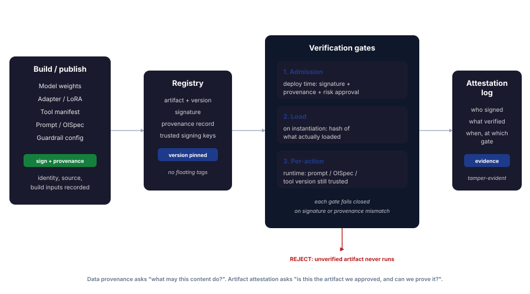

# Provenance and Attestation

> Data provenance asks what a piece of content is allowed to *do*. Artifact attestation asks whether the model, tool, or prompt about to run is the one you actually approved, and whether you can *prove* it.

These are two different questions, and the site has so far answered only the first one well. [Data Provenance and Authority Boundaries](data-provenance-and-authority-boundaries.md) governs untrusted content as it flows at runtime: tag it as data at the boundary, never let it self-promote to instruction. That is about *behaviour*. This page is about *identity*: of the model weights, the fine-tuning adapter, the tool manifest, the guardrail config, and the prompt or OISpec the agent is executing against. The runtime control layers (Guardrails, Judge, Oversight) all assume the thing they are wrapped around is the thing that was tested and approved. Attestation is the control that makes that assumption checkable rather than assumed.

The existing supply-chain control [SUP-01](../../infrastructure/agentic/supply-chain.md#sup-01-verify-model-provenance-and-integrity) already requires model hashing, signature validation, and a model registry. This page generalises that from a single checklist line about *models* into a discipline that covers the *whole artifact set* and, crucially, extends verification from deploy time into runtime, where AI artifacts uniquely keep changing.

## Why software signing does not cover AI

Mature software supply chains already sign and verify build artifacts. AI breaks three assumptions those pipelines rely on.

| Software assumption | AI reality |
|---|---|
| The deployed artifact is a binary built once and shipped | The runtime behaviour is set by weights *plus* adapters *plus* a system prompt *plus* an OISpec *plus* tool definitions, assembled at request time and changed without a redeploy |
| Provenance is a build-time concern | A model is swapped, an adapter is hot-loaded, a prompt is edited in a console, a tool manifest is updated by a third party, all after deployment and outside the build pipeline |
| The dangerous artifacts are executables | A serialized model can execute code on load (pickle deserialization), and a prompt or tool description is itself an instruction-bearing artifact that changes behaviour with no code change at all |

The consequence: signing the container image is necessary and nowhere near sufficient. The artifacts that actually determine AI behaviour are the ones least likely to be inside the signed image, and most likely to change after it ships.

## The artifact set that needs attestation

{ .arch-diagram }

Each of these changes behaviour, and each should carry a signature and a provenance record before it is allowed to run.

| Artifact | What attestation establishes | Why it matters at runtime |
|---|---|---|
| **Model weights** | Published by the claimed source, unmodified since | A substituted or poisoned model invalidates every guardrail calibration and judge baseline tuned against the approved one |
| **Adapters / LoRA / fine-tunes** | Trained from the declared base and dataset, by the declared owner | Adapters are small, easy to swap, and can re-introduce behaviour the base model was selected to avoid |
| **Tool / MCP manifests** | The tool description and schema match what was reviewed | A third party editing a tool description is a behaviour change with no code change: the agent now reads different instructions |
| **Prompts / OISpecs** | This is the version that was reviewed and approved | The system prompt and declared intent *are* the policy; an unsigned prompt edit is an unaudited policy change |
| **Guardrail / judge configs** | The safety models and rules are the ones that were tested | Guardrails are themselves ML artifacts and rule sets; a quiet config change weakens the control silently |
| **Retrieval corpora** | The knowledge base content has a known, attestable source set | Poisoned retrieval is behaviour change by data; provenance over the corpus bounds what can enter reasoning |

The unifying claim attestation makes for every row: *this artifact, this version, from this signer, with this lineage, unmodified.* If you cannot make that claim, the downstream controls are protecting an unknown.

## Three verification gates

A signature is worthless if it is checked once, far from where the artifact runs. AI artifacts change after deployment, so verification has to happen at three distinct points, each failing closed.

1. **Admission gate (deploy time).** Before an artifact enters the approved registry: validate the signature against the trusted-key set, check the provenance record, confirm risk approval for the intended tier. This is the strongest and most familiar gate, and it is where [SUP-01](../../infrastructure/agentic/supply-chain.md#sup-01-verify-model-provenance-and-integrity) lives today.
2. **Load gate (instantiation).** When the artifact is actually loaded into a serving process: re-hash what loaded and compare to the registered value. This catches substitution between approval and execution, and it is the gate that defends against load-time code execution in serialized formats. Prefer formats that cannot execute on load (for example safetensors over pickle) so the load gate is verifying integrity, not containing arbitrary code.
3. **Per-action gate (runtime).** At the moment an agent uses a prompt, an OISpec, or a tool: confirm the version in effect is still a trusted, signed version. This is the gate that has no software equivalent and that AI specifically needs, because the prompt and tool layer is edited live, by people, outside any build. It ties directly to the [authority-transition check](data-provenance-and-authority-boundaries.md#the-invariant): an unsigned or version-drifted OISpec is not a valid expectation to evaluate conformance against.

!!! warning "Verify what loaded, not what you intended to load"
    The common failure is checking a hash in a manifest and then loading a file by path or tag that something else can swap. The integrity check must be on the bytes that actually entered the process, bound to the version the registry approved. A check that runs before the substitution point proves nothing about what ran.

## Provenance, not just a signature

A signature proves *who* vouched for an artifact. Provenance proves *how it came to exist*. Both are needed, and the second is what regulators and incident responders actually ask for.

A provenance record, in the style of in-toto and SLSA, captures the build as verifiable metadata: what base model and dataset went in, what process produced the artifact, who ran it, and what the outputs were. For AI this lineage is the spine of several controls at once:

- **Poisoning investigation.** When a model misbehaves, lineage tells you which dataset and which training run to suspect, instead of guessing.
- **Licence and data-rights evidence.** The declared training inputs are the record that the artifact was built from data you were entitled to use.
- **Reproducibility.** A pinned, attested lineage is what lets you rebuild or re-evaluate the exact artifact later, which is the difference between an audit you can pass and one you cannot.

Provenance metadata should be signed and stored *with* the artifact in the registry, version-pinned, never floating. A provenance record you cannot verify the integrity of is documentation, not evidence.

## Attestation as audit evidence

The verification results are not throwaway. Each gate produces a record (which artifact, which version, which signer, verified against which keys, at which gate, passed or failed) and that record belongs in the same tamper-evident store as the rest of the runtime evidence: the [flight recorder](../../insights/the-flight-recorder-problem.md) and [logging and observability](../../infrastructure/controls/logging-and-observability.md) layer.

This is what turns attestation from a deploy-time hygiene step into continuous assurance. It also lands directly on regulatory record-keeping demands:

- **EU AI Act** requires technical documentation and automatic record-keeping for high-risk systems (Articles 11 and 12, Annex IV). Attestation records are precisely the evidence that the deployed system matches the documented and approved one, maintained automatically rather than reconstructed after the fact.
- **NIST AI RMF** Map and Manage functions call for traceability of AI components and their provenance. Signed lineage is the artifact-level expression of that traceability.
- **ISO/IEC 42001** management-system controls expect documented, auditable control over AI assets across their lifecycle.

The compliance dividend mirrors the one on the [data provenance page](data-provenance-and-authority-boundaries.md#the-compliance-dividend): "the model in production is the model we approved" stops being an assertion a reviewer has to trust and becomes a signed record they can verify.

## What attestation closes, and what it does not

| Threat | How attestation addresses it |
|---|---|
| **Model substitution** | Load-gate hash mismatch blocks an unapproved model from serving |
| **Poisoned adapter or fine-tune** | Adapters carry their own signature and lineage; an unsigned or unattested adapter never loads |
| **Tool-manifest tampering** | A changed, unsigned tool description fails the per-action gate before the agent reads it |
| **Silent prompt / OISpec edits** | Unsigned or version-drifted intent fails the per-action gate; policy changes become signed, audited events |
| **Guardrail downgrade** | Safety configs are attested artifacts; a quiet weakening is a signature change, not an invisible one |
| **Load-time code execution** | Non-executable formats plus load-gate verification remove the deserialization path |

Attestation proves an artifact is the approved one. It does **not** prove the approved artifact is safe. A signed, well-attested model can still be misaligned, and a signed prompt can still be a bad policy. Attestation establishes integrity and provenance; the [risk assessment](../risk-assessment.md), red-teaming, and the runtime [control layers](../controls.md) establish whether the approved artifact should be trusted to act. Provenance is necessary, not sufficient, in exactly the way the data-provenance invariant is.

## How this maps to the existing framework

| Existing control | Role under attestation |
|---|---|
| [SUP-01 model provenance](../../infrastructure/agentic/supply-chain.md#sup-01-verify-model-provenance-and-integrity) | The admission gate for models; this page extends it to the full artifact set and to the load and per-action gates |
| [Data Provenance and Authority Boundaries](data-provenance-and-authority-boundaries.md) | The runtime-content counterpart: provenance over what content *does*, where this page is provenance over what artifacts *are* |
| [Objective Intent / OISpec](../../maso/controls/objective-intent.md) | The OISpec is an attestable artifact; signing it makes the declared expectation tamper-evident before it is used as the conformance baseline |
| [Flight recorder](../../insights/the-flight-recorder-problem.md) / [Logging & Observability](../../infrastructure/controls/logging-and-observability.md) | The tamper-evident home for attestation records as continuous evidence |
| [Secrets & Credentials](../../infrastructure/controls/secrets-and-credentials.md) | Signing keys are high-value secrets; key custody and rotation are what the whole chain of trust rests on |
| [Risk Assessment](../risk-assessment.md) | Decides which artifacts and which tiers warrant which gates; attestation depth should track risk, not be uniform |

## A proportionate adoption ladder

Attestation is not all-or-nothing, and applying every gate to every artifact at every tier is the same mistake as running a cloud judge on every read.

- **Tier 1.** Admission gate for models and adapters: verified source, recorded hash, signature where the publisher provides one, version pinning. This is table stakes and is mostly [SUP-01](../../infrastructure/agentic/supply-chain.md#sup-01-verify-model-provenance-and-integrity).
- **Tier 2.** Add the load gate (verify what actually loaded), sign prompts and OISpecs, and write attestation records to the audit store. Bring tool and guardrail configs into the registry.
- **Tier 3.** Add the per-action gate for prompts, OISpecs, and tool manifests; require signed provenance lineage (in-toto / SLSA style) for models and adapters; treat any unattested artifact in the serving path as a fail-closed condition.

The ordering principle is the same one used throughout this framework: push verification as early and as deterministic as possible (a signature check never decays the way a content classifier does), and reserve the heavier, runtime gates for the artifacts and tiers where a silent swap would actually hurt.

!!! info "References"
    - [Sigstore: signing, verification, and provenance for software artifacts](https://www.sigstore.dev/)
    - [OpenSSF Model Signing project](https://github.com/sigstore/model-transparency)
    - [in-toto: a framework to secure the integrity of software supply chains](https://in-toto.io/)
    - [SLSA: Supply-chain Levels for Software Artifacts](https://slsa.dev/)
    - [OWASP Top 10 for LLM Applications: LLM03 Supply Chain, LLM04 Data and Model Poisoning](https://genai.owasp.org/resource/owasp-top-10-for-llm-applications-2025/)
    - [NIST AI 600-1: Generative AI Profile](https://nvlpubs.nist.gov/nistpubs/ai/NIST.AI.600-1.pdf)
    - [EU AI Act, Articles 11 and 12 and Annex IV: technical documentation and record-keeping](https://artificialintelligenceact.eu/)
    - [Hugging Face safetensors: a safe format for storing tensors](https://github.com/huggingface/safetensors)
