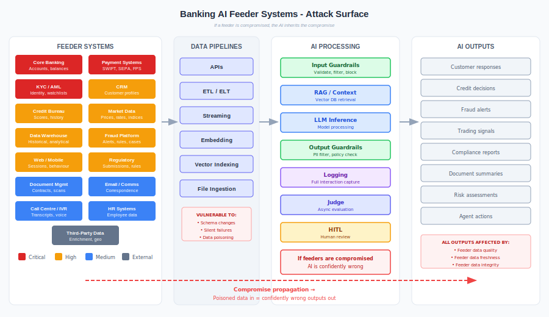

# High-Risk Financial Services

The top 10 risks of deploying AI in financial services - and how AI runtime behavioural security addresses each one.

---

## Why Financial Services Is the Stress Test

Financial services is where AI runtime security matters most. High regulatory burden, real-time transaction processing, zero tolerance for unexplainable decisions, and critical functions - payments, credit, trading - where AI errors have immediate financial and regulatory consequences. If a control pattern works here, it works anywhere.

This document examines the risks that emerge when financial institutions deploy AI systems for critical functions - and maps each risk to the three-layer defence pattern.

| Lens | Question |
|------|----------|
| **AI deployment risk** | What can go wrong when AI operates in critical financial functions without adequate controls? |
| **Three-layer defence** | How does the Guardrails → Judge → Human Oversight pattern address each risk? |

### Scope

The three-layer runtime pattern (Guardrails prevent, Judge detects, Humans decide) is designed for **AI behavioural security** - controlling what AI systems say and do at runtime. The risks in this document are the risks that arise *from deploying AI itself* in financial services: AI making payments without validation, AI hallucinating financial data, AI producing unexplainable credit decisions, AI leaking customer data in responses.

These are not general cybersecurity risks like ransomware or DDoS - those exist whether or not you deploy AI and require traditional infrastructure controls. This document focuses on the risks that are unique to, or significantly amplified by, putting AI in the critical path of financial operations.

---

## Risk 1: AI in Payments and Transactions Without Controls

**The risk:** Financial institutions deploy AI systems that initiate, approve, or process payments without adequate validation controls. An AI chatbot processes a refund it shouldn't. An AI assistant initiates a transfer based on a hallucinated instruction. An AI agent applies an unauthorised discount. When AI operates in the payment path without controls, every failure has direct financial impact.

**Why this matters in financial services:**

| Scenario | Impact |
|----------|--------|
| AI processes payment for wrong amount | Direct financial loss; customer dispute |
| AI initiates transfer based on manipulated prompt | Fraudulent transaction executed with system authority |
| AI applies unauthorised pricing or discount | Revenue leakage at scale |
| AI chatbot authorises refund without verification | Financial loss; potential for systematic exploitation |
| AI agent executes trade without validation | Market impact; regulatory breach |

**Three-layer fit:** Strongest. This is exactly what the three-layer pattern was designed for - controlling what AI systems *do* at runtime when those actions have financial consequences.

| Layer | Role |
|-------|------|
| **Guardrails** (primary) | Transaction amount validation against cart/order; payment method confirmation; duplicate detection; monetary thresholds that trigger escalation; action allowlisting |
| **Judge** (primary) | Evaluates whether the payment action matches the conversation context - "did the customer actually request this?"; flags transactions where AI reasoning doesn't support the action; detects prompt manipulation leading to unauthorised transactions |
| **Human Oversight** (primary) | Reviews all transactions above threshold; approves high-value or unusual payment actions; final authority on flagged transactions |
| Infrastructure | Payment gateway validation (amount, card, 3DS); fraud detection; reconciliation |

**PACE posture for payment-path AI:**
- **Primary:** All three layers active; AI processes payments within validated parameters
- **Alternate:** Judge unavailable → all payment actions require human approval before execution
- **Contingency:** Multiple layers degraded → AI enters read-only mode (can answer questions, cannot process payments)
- **Emergency:** Circuit breaker → AI removed from payment path; fallback to traditional payment interface

---

## Risk 2: Hallucinated Financial Information

**The risk:** AI systems fabricate financial data - account balances, interest rates, product terms, regulatory obligations, transaction histories - and present it with full confidence. In financial services, a hallucinated number isn't an inconvenience; it's a potential mis-selling event, a regulatory breach, or a basis for a customer's financial decision.

**Why this matters in financial services:**

| Scenario | Impact |
|----------|--------|
| AI states wrong interest rate or product terms | Mis-selling; regulatory action; customer compensation |
| AI fabricates account balance or transaction history | Customer makes financial decisions on false information |
| AI invents regulatory requirements | Unnecessary compliance costs or, worse, false sense of compliance |
| AI generates incorrect tax or fee calculations | Financial loss; customer complaints; regulatory exposure |
| AI hallucinates credit terms in a lending conversation | Binding commitment on fabricated terms |

**Three-layer fit:** Strong. Hallucination is a runtime behavioural problem - the AI generates incorrect outputs that look correct. This is precisely what the three-layer pattern detects.

| Layer | Role |
|-------|------|
| **Guardrails** (primary) | Output validation against source systems - every stated balance, rate, or term verified against the system of record before delivery; format validation; range checks on financial figures |
| **Judge** (primary) | Semantic grounding evaluation - "are all financial claims in this response supported by retrieved data?"; detects when the model generates rather than retrieves; flags confident assertions without source backing |
| Human Oversight | Reviews flagged hallucination alerts; spot-checks random interactions; investigates patterns of hallucination in specific product areas |
| Infrastructure | RAG architecture with source attribution; system-of-record APIs; data freshness monitoring |

---

## Risk 3: Data Leakage Through AI Responses

**The risk:** AI systems surface customer data - PII, account details, transaction history, financial records - to the wrong person. The AI doesn't exfiltrate data through the network; it speaks it in a response. A model that has broad data access to be useful can leak that data to any user who asks the right question.

**Why this matters in financial services:**

| Scenario | Impact |
|----------|--------|
| AI reveals another customer's account details | Data breach; regulatory notification; reputational damage |
| AI surfaces transaction history to unauthorised user | Privacy violation; potential for financial exploitation |
| AI echoes PII from training data | GDPR/privacy breach at scale |
| AI includes sensitive data in a response the user didn't request | Over-disclosure; need-to-know violation |
| Cross-session contamination leaks customer context | One customer sees another's financial data |

AI creates entirely new data exfiltration vectors that traditional DLP doesn't cover. A model doesn't send data through the network - it speaks it in a response.

**Three-layer fit:** Strong. This is the framework's sweet spot.

| Layer | Role |
|-------|------|
| **Guardrails** (primary) | PII detection in every output; content filtering blocks sensitive data patterns; data masking before response delivery; cross-reference output data against requesting user's permissions |
| **Judge** (primary) | Evaluates whether responses contain data the user shouldn't see; detects prompt-based extraction attempts; flags training data memorisation; identifies cross-session contamination |
| Human Oversight | Reviews flagged data exposure incidents; approves exceptions to data controls |
| Infrastructure | Encryption, access control, data classification, tokenisation, session isolation |

---

## Risk 4: Unexplainable AI Decisions

**The risk:** AI systems make or influence decisions - credit approvals, fraud flags, risk ratings, pricing - that cannot be explained to the customer, the regulator, or the internal audit function. In financial services, explainability isn't optional. Regulators require it (EU AI Act Art. 13, GDPR Art. 22, ECOA adverse action notices). Customers have a right to understand decisions that affect them.

**Why this matters in financial services:**

| Scenario | Impact |
|----------|--------|
| AI declines credit application with no explainable reason | Regulatory breach (adverse action notice requirements) |
| AI flags customer as high-risk but can't justify why | AML/KYC process failure; potential discrimination claim |
| AI prices a product differently for different customers without traceable logic | Fair treatment violation; regulatory scrutiny |
| AI recommends investment but can't explain the basis | MiFID II suitability obligation breach |
| Auditor asks how a decision was made and there's no trail | Audit failure; regulatory enforcement |

**Three-layer fit:** Strong. Explainability is a runtime requirement - you need to capture and evaluate the reasoning behind every decision as it happens, not reconstruct it after the fact.

| Layer | Role |
|-------|------|
| Guardrails | Enforce structured output formats that include reasoning; reject decisions without required justification fields; ensure adverse action notices include required content |
| **Judge** (primary) | Evaluates decision quality and reasoning - "does the stated rationale actually support the conclusion?"; detects reasoning gaps; flags decisions where the explanation contradicts the evidence; validates that protected characteristics were not decision factors |
| **Human Oversight** (primary) | Reviews all adverse decisions; validates reasoning quality; provides the human accountability regulators require (GDPR Art. 22, EU AI Act Art. 14); documented review trails |
| Infrastructure | Tamper-proof decision logging; reasoning chain capture; audit trail retention (7+ years for regulated decisions) |

---

## Risk 5: AI Bias and Discrimination in Financial Decisions

**The risk:** AI systems produce discriminatory outcomes - approving or denying credit, pricing products, assessing risk, or flagging fraud based on protected characteristics. Bias can be embedded in training data, amplified by model architecture, or introduced through proxy variables. In financial services, discriminatory AI decisions trigger fair lending violations, equal treatment breaches, and regulatory enforcement.

**Why this matters in financial services:**

| Scenario | Impact |
|----------|--------|
| AI credit model denies applications at higher rates for protected groups | Fair lending violation (ECOA, CRA); regulatory enforcement; litigation |
| AI pricing model charges different rates correlated with ethnicity or postcode | Redlining by algorithm; regulatory action |
| AI fraud detection flags legitimate transactions from certain demographics | Customer harm; discrimination complaint |
| AI customer service provides different quality responses based on customer profile | Fair treatment violation |
| AI recruitment tool screens out candidates from certain backgrounds | Employment discrimination liability |

**Three-layer fit:** Strong. Bias manifests in AI outputs - the decisions and recommendations the system produces at runtime. The three-layer pattern can detect and flag biased outputs before they cause harm.

| Layer | Role |
|-------|------|
| **Guardrails** (primary) | Protected-class input filtering; reject decisions that reference prohibited factors; enforce fairness constraints on outputs (e.g., decision rate parity checks) |
| **Judge** (primary) | Fairness evaluation per decision - statistical analysis of decision patterns; detects proxy discrimination; flags when decision distributions shift across demographic groups; compares individual decisions against fairness benchmarks |
| **Human Oversight** (primary) | Reviews all adverse decisions for bias indicators; portfolio-level fairness reviews; responds to discrimination complaints with full decision audit trail |
| Infrastructure | Bias testing in model development; representative training data; independent model validation (OCC/Fed SR 11-7 guidance) |

---

## Risk 6: Insider Manipulation of AI Systems

**The risk:** Insiders - employees, contractors, vendors with legitimate access - modify AI system behaviour to disable controls, extract data, or manipulate outcomes. A single prompt change can fundamentally alter what an AI system does, and it's harder to detect than a firewall rule change. In financial services, AI configuration access is effectively access to decision-making authority.

**Why this matters in financial services:**

| Scenario | Impact |
|----------|--------|
| Prompt engineer modifies system prompt to bypass guardrails | Controls silently disabled; all subsequent outputs uncontrolled |
| Insider weakens Judge evaluation criteria | Flagging rate drops; harmful outputs go undetected |
| HITL reviewer deliberately approves flagged transactions | Fraud or data breach enabled by compromised control layer |
| Insider modifies AI trading parameters | Unauthorised market exposure |
| Staff deploy shadow AI that bypasses all controls | Uncontrolled AI operating on customer data |

AI systems amplify insider risk because a single prompt change can fundamentally alter system behaviour - and it's harder to detect than a firewall rule change.

**Three-layer fit:** Strong. The three-layer pattern's independent failure domains are specifically designed for this: a compromised guardrail doesn't fool the Judge, and a compromised Judge doesn't bypass Human Oversight.

| Layer | Role |
|-------|------|
| Guardrails | Version-controlled configurations; reject unauthorised parameter changes |
| **Judge** (primary) | Configuration drift detection; detects when guardrail criteria weaken; flags prompt modifications that reduce safety coverage |
| **Human Oversight** (primary) | Approves all configuration changes to AI systems; reviews HITL reviewer decisions for collusion; mandatory sign-off for Judge criteria changes |
| Infrastructure | PAM, session recording, immutable audit logs, Git-based config management |

---

## Risk 7: AI Operating Beyond Authorised Scope

**The risk:** AI systems take actions or access data beyond what they were designed and authorised to do. An AI assistant designed to answer product questions starts modifying account settings. An AI fraud analyst accesses customer data outside its investigation scope. Scope creep in AI systems is particularly dangerous because it's often invisible - the AI doesn't error, it simply does more than intended.

**Why this matters in financial services:**

| Scenario | Impact |
|----------|--------|
| AI customer assistant modifies account settings it should only read | Unauthorised account changes; potential financial impact |
| AI accesses data across business divisions (breaking Chinese walls) | Regulatory breach; insider dealing risk |
| AI agent chains escalate privileges through delegation | Transitive authority creates unintended access |
| AI processes data outside authorised jurisdiction | Data residency violation; regulatory breach |
| AI takes autonomous actions that should require human approval | Unapproved financial commitments; regulatory breach |

**Three-layer fit:** Strong. Scope enforcement is a runtime control problem - you need to validate what the AI is doing on every interaction, not just at deployment time.

| Layer | Role |
|-------|------|
| **Guardrails** (primary) | Action allowlisting - explicit registry of permitted actions per AI system; enforce read-only by default; block write operations unless explicitly authorised; validate data access scope against user permissions |
| **Judge** (primary) | Evaluates whether the AI's actions are within authorised scope - "is this action consistent with this system's mandate?"; detects privilege escalation through agent chains; flags data access outside the user's permissions |
| Human Oversight | Reviews scope violations; approves exceptions; periodic audit of AI system capabilities vs. authorised scope |
| Infrastructure | Per-system service accounts with scoped permissions; context-aware access control; network segmentation |

---

## Risk 8: Adversarial Manipulation of AI Behaviour

**The risk:** Attackers craft inputs designed to make AI systems behave incorrectly - prompt injection that changes the system's instructions, adversarial inputs that evade fraud detection, data poisoning that corrupts the model's understanding. In financial services, adversarial manipulation of AI can lead to unauthorised transactions, bypassed fraud controls, or manipulated risk assessments.

**Why this matters in financial services:**

| Scenario | Impact |
|----------|--------|
| Prompt injection causes AI to bypass payment controls | Unauthorised financial transactions |
| Adversarial inputs crafted to evade AI fraud detection | Fraudulent transactions processed undetected |
| Data poisoning corrupts AI credit model | Systematic approval of high-risk applications |
| Indirect injection via poisoned documents in RAG | AI decisions based on attacker-controlled content |
| Chatbot socially engineered into revealing account information | Data breach through conversational manipulation |

This is where adversarial intent meets AI deployment risk. The attack surface exists because the AI is deployed in a critical function.

**Three-layer fit:** Strong. This is the adversarial scenario the three-layer pattern was designed for. Independent failure domains mean an attack that bypasses guardrails still faces the Judge (different model, different evaluation criteria), and attacks that fool both still face Human Oversight.

| Layer | Role |
|-------|------|
| **Guardrails** (primary) | Adversarial input detection; prompt injection filtering; encoding and obfuscation detection; input normalisation |
| **Judge** (primary) | Evaluates whether outputs are policy-compliant despite adversarial manipulation; detects model evasion patterns; independent evaluation means different attack surface from guardrails |
| Human Oversight | Red team exercises; reviews novel attack patterns; updates guardrail and Judge criteria based on findings |
| Infrastructure | Adversarial robustness testing pipelines; model update and patch management |

---

## Risk 9: Regulatory Non-Compliance

**The risk:** AI systems operate in ways that breach regulatory requirements - automated decisions without human involvement (GDPR Art. 22), unexplainable outcomes (EU AI Act), unfair treatment (ECOA), inadequate record-keeping (MiFID II), or cross-border data processing without legal basis. Every jurisdiction is developing AI-specific regulation at different speeds, creating a patchwork of requirements that financial institutions must navigate.

**Why this matters in financial services:**

| Scenario | Impact |
|----------|--------|
| AI makes automated decisions affecting individuals without human involvement | GDPR Art. 22 breach; regulatory enforcement |
| AI processes customer data across jurisdictions without legal basis | Data protection breach; cross-border regulatory action |
| AI system cannot produce audit trail for regulatory examination | Examination failure; enforcement action |
| AI system lacks required fairness documentation | EU AI Act non-compliance; regulatory fine |
| AI-generated communications don't meet disclosure requirements | Consumer protection breach |

**Three-layer fit:** Strong. Regulatory compliance is about proving your AI systems behave correctly - exactly what the three-layer pattern provides.

| Layer | Role |
|-------|------|
| Guardrails | Enforce compliance boundaries (data residency, consent checks, content policy, mandatory disclosures) |
| **Judge** (primary) | Continuous compliance evaluation; generates audit evidence showing every interaction was assessed; detects explainability gaps; validates adverse action notice content |
| **Human Oversight** (primary) | Provides the human accountability regulators require (GDPR Art. 22, EU AI Act Art. 14); documented review trails; responds to regulator inquiries with full decision history |
| Infrastructure | Tamper-proof audit logging; evidence retention; regulatory reporting pipelines |

---

## Risk 10: AI-Enabled Fraud

**The risk:** AI systems are deployed for fraud detection, transaction monitoring, and customer verification - but those same systems can be manipulated, evaded, or exploited. Simultaneously, fraudsters use AI to generate synthetic identities, forge documents, and optimise money laundering networks. The deployment of AI in fraud-critical functions creates both defensive capability and new attack surface.

**Why this matters in financial services:**

| Scenario | Impact |
|----------|--------|
| AI-generated synthetic identities pass AI-powered KYC | Fraudulent accounts opened at scale |
| Adversarial evasion of AI fraud detection | Fraudulent transactions processed as legitimate |
| AI chatbot sessions manipulated to authorise transactions | Account takeover via conversational manipulation |
| AI-generated forged documents pass AI document verification | Loan fraud; insurance fraud |
| AI mule network optimisation evades AI pattern detection | Money laundering at scale |

**Three-layer fit:** Strongest. Fraud detection in financial services is the canonical use case for runtime behavioural security.

| Layer | Role |
|-------|------|
| **Guardrails** (primary) | Transaction limits, velocity checks, content filtering on AI-generated documents, synthetic identity detection rules |
| **Judge** (primary) | Evaluates transaction patterns against behavioural baselines; detects mule network patterns; flags AI-generated document forgeries; identifies adversarial evasion of fraud rules |
| **Human Oversight** (primary) | Reviews flagged transactions; makes final fraud/not-fraud determination; escalates novel patterns; provides feedback to improve Judge accuracy |
| Infrastructure | Transaction monitoring infrastructure; network analysis; behavioural biometrics |

---

## Summary: Risk to Three-Layer Mapping

| # | AI Deployment Risk | Three-Layer Fit | Primary Defence Layer | What the Pattern Addresses |
|---|-----------|----------------|----------------------|---------------------------|
| 1 | AI in payments without controls | **Strongest** | All three layers | Guardrails validate transactions; Judge evaluates intent vs. action; Humans approve high-value |
| 2 | Hallucinated financial information | **Strong** | Guardrails + Judge | Output validation against source systems; semantic grounding evaluation |
| 3 | Data leakage through AI responses | **Strong** | Guardrails + Judge | PII detection in outputs; Judge catches extraction attempts; new vectors, new defences |
| 4 | Unexplainable AI decisions | **Strong** | Judge + Human Oversight | Judge evaluates reasoning quality; Human Oversight provides regulatory accountability |
| 5 | AI bias and discrimination | **Strong** | All three layers | Guardrails enforce fairness constraints; Judge detects distributional bias; Humans review adverse decisions |
| 6 | Insider manipulation of AI | **Strong** | Judge + Human Oversight | Judge detects config drift; Human Oversight enforces separation of duties on AI config |
| 7 | AI operating beyond authorised scope | **Strong** | Guardrails + Judge | Action allowlisting; scope validation; privilege escalation detection |
| 8 | Adversarial manipulation of AI | **Strong** | Guardrails + Judge | Independent failure domains - adversarial bypass of guardrails still faces Judge |
| 9 | Regulatory non-compliance | **Strong** | Judge + Human Oversight | Judge provides continuous compliance evidence; Human Oversight delivers accountability |
| 10 | AI-enabled fraud | **Strongest** | All three layers | Canonical use case: guardrails enforce limits, Judge detects anomalies, humans decide |

### What This Tells You

**All 10 risks map strongly to the three-layer pattern.** This is by design - these are risks that arise from deploying AI in critical financial functions, which is exactly what the three-layer runtime pattern was built to address. Every risk manifests through AI behaviour: what the system says, what decisions it makes, what actions it takes, what data it surfaces.

**3 risks require all three layers at full strength** (Payments, Bias, Fraud). These involve AI taking actions with direct financial or legal consequences - every layer provides independent, essential coverage.

**4 risks are primarily a Guardrails + Judge problem** (Hallucination, Data leakage, Scope violations, Adversarial manipulation). Detection and prevention at the output layer, with Human Oversight for edge cases and pattern review.

**3 risks are primarily a Judge + Human Oversight problem** (Explainability, Insider manipulation, Regulatory compliance). These require continuous evaluation and human accountability rather than real-time blocking.

General cybersecurity risks - ransomware, DDoS, cloud misconfiguration - exist whether or not you deploy AI. They require traditional infrastructure controls and are addressed by the framework's [infrastructure controls](../../infrastructure/README.md), not the three-layer runtime pattern. This document focuses on the risks that the three-layer pattern was designed to address.

---

## Feeder Systems: What Feeds the AI

AI systems don't generate knowledge from nothing. They consume data from upstream financial systems - and inherit every vulnerability those systems carry. If a feeder system is compromised, the AI is confidently wrong or actively dangerous.



### The Financial Services AI Data Supply Chain

```
Feeder Systems → Data Pipelines → AI Processing → Outputs
(if any link is compromised, the AI inherits the compromise)
```

### Feeder System Inventory

| Feeder System | What It Feeds the AI | Data Sensitivity |
|---------------|---------------------|------------------|
| **Core Banking** | Account balances, transaction history, customer status | Critical |
| **CRM** | Customer profiles, interaction history, preferences | High |
| **Payment Systems** (SWIFT, SEPA, Faster Payments) | Transaction data, payment instructions | Critical |
| **KYC/AML Platform** | Customer identity, risk ratings, watchlist matches | Critical |
| **Credit Bureau Feeds** | Credit scores, repayment history, defaults | High |
| **Market Data** (Bloomberg, Reuters, exchanges) | Prices, rates, indices, economic data | High |
| **Document Management** | Scanned documents, contracts, correspondence | Medium-High |
| **Data Warehouse / Data Lake** | Aggregated, historical, analytical data | High |
| **HR Systems** | Employee data (if AI used for internal processes) | High |
| **Regulatory Reporting** | Regulatory submissions, compliance data | High |
| **Email / Communications** | Customer and internal communications | Medium-High |
| **Call Centre / IVR** | Call transcripts, voice recordings | Medium-High |
| **Web / Mobile Banking** | Session data, user behaviour, transaction requests | High |
| **Fraud Detection Platform** | Alerts, rules, case data | High |
| **Third-Party Data Providers** | Enrichment data, demographic, geolocation | Medium |

### How Feeder System Compromise Maps to the 10 Risks

| Feeder System | Relevant AI Risks | Compromise Scenario |
|---------------|---------------------|---------------------|
| **Core Banking** | #1 Payments, #2 Hallucination, #3 Data leakage | Core banking data stale → AI processes payments against wrong balances. Core banking breached → AI surfaces stolen data in responses. Data corrupted → AI makes decisions on false information. |
| **CRM** | #2 Hallucination, #3 Data leakage | CRM data corrupted → AI customer insights built on wrong profiles. CRM breached → AI-powered personalisation surfaces compromised data. |
| **Payment Systems** | #1 Payments, #10 Fraud | Payment data manipulated → AI learns wrong transaction patterns. Mule transactions injected → AI trained on fraudulent baselines. Payment system down → AI fraud detection blind. |
| **KYC/AML Platform** | #5 Bias, #9 Regulatory, #10 Fraud | KYC data poisoned → AI approves synthetic identities. AML watchlist outdated → AI misses sanctioned entities. Biased KYC data → AI perpetuates discriminatory onboarding. |
| **Credit Bureau Feeds** | #2 Hallucination, #5 Bias, #10 Fraud | Bureau data manipulated → AI approves fraudulent credit applications. Feed interrupted → AI makes lending decisions without current credit data. Historical bias in bureau data → AI perpetuates discriminatory lending. |
| **Market Data** | #2 Hallucination, #7 Scope | Market data feed poisoned → AI trading/risk models act on false prices. Feed goes down → AI uses stale data, makes wrong recommendations. AI acts on stale data outside authorised parameters. |
| **Document Management** | #8 Adversarial, #10 Fraud | Forged documents uploaded → AI processes and trusts fraudulent content. AI-generated fake documents inserted → downstream processes approve fraudulent applications. |
| **Data Warehouse** | #3 Data leakage, #5 Bias, #6 Insider | Warehouse breached → AI training data exposed. Insider modifies historical data → AI models retrained on corrupted data. Biased historical data → AI learns and amplifies historical discrimination. |
| **HR Systems** | #3 Data leakage, #6 Insider | HR data exposed via AI-powered internal tools. Insider modifies access records → AI grants inappropriate permissions. |
| **Email / Comms** | #3 Data leakage, #8 Adversarial | AI processes phishing emails as legitimate correspondence. AI summarises confidential communications to unauthorised users. Indirect prompt injection via email content. |
| **Web / Mobile** | #7 Scope, #8 Adversarial | Session data manipulated → AI learns from bot traffic. Adversarial inputs via web interface exploit AI customer service. |
| **Fraud Platform** | #6 Insider, #10 Fraud | Insider suppresses fraud alerts before AI sees them. Fraud rules manipulated → AI fraud models learn to ignore real fraud. |
| **Third-Party Data** | #2 Hallucination, #5 Bias | Enrichment data poisoned → AI decisions based on false demographics. Biased third-party data → AI inherits provider's biases. |

### The Cascading Failure Problem

A single feeder system compromise can cascade through multiple AI systems:

| Scenario | Cascade Path | Impact |
|----------|-------------|--------|
| Core banking data corruption | Wrong balances → AI customer service gives false information → AI payments process against wrong amounts → AI fraud detection sees corrupted baselines | Multiple AI systems fail simultaneously, all producing confident but wrong outputs |
| CRM breach | CRM data exposed → AI customer assistant has compromised context → AI-generated communications reference leaked data → Regulatory and reputational damage | Privacy violation amplified by AI |
| Market data poisoning | False prices → AI risk models miscalculate → Trading AI acts on bad data → AI reporting shows wrong positions → Regulatory breach | Financial loss compounded at each AI layer |
| KYC data manipulation | Synthetic identity passes KYC → AI onboarding approves → AI credit model approves loan → AI fraud detection sees "legitimate" customer → No alerts generated | End-to-end fraud enabled by trusted feeder |

### Feeder System Controls

| Control | Purpose | Framework Mapping |
|---------|---------|-------------------|
| **Data integrity validation** | Verify feeder data hasn't been tampered with before AI ingestion | AI.5 Data Governance |
| **Freshness monitoring** | Alert when feeder data is stale beyond threshold | AI.5 Data Governance, AI.11 Monitoring |
| **Source authentication** | Verify feeder system identity before accepting data | AI.7 Guardrails |
| **Schema validation** | Reject data that doesn't match expected format | AI.7 Guardrails |
| **Anomaly detection on inputs** | Flag when feeder data distribution shifts unexpectedly | AI.8 Judge |
| **Fallback behaviour** | Define what AI does when feeder is unavailable (degrade gracefully, not silently) | AI.15 Continuity |
| **Data lineage tracking** | Know which feeder system produced which data in which AI output | AI.5 Data Governance |
| **Access segregation** | AI reads from replicas, not production feeder systems | AI.4 Development |
| **Reconciliation** | Compare AI's view of data against source of truth periodically | AI.11 Monitoring |

### Feeder System Checklist (Per AI System)

| Check | Status |
|-------|--------|
| All feeder systems identified and documented? | ☐ |
| Data flows mapped (what data, from where, how often)? | ☐ |
| Freshness thresholds defined per feeder? | ☐ |
| Fallback behaviour defined if feeder unavailable? | ☐ |
| Data integrity validation in place? | ☐ |
| Feeder system included in AI system risk assessment? | ☐ |
| Feeder system owners aware their data feeds AI? | ☐ |
| Incident response covers feeder system compromise? | ☐ |
| Data lineage tracked from feeder to AI output? | ☐ |

---

## Access Controls: Who Can Touch What

AI systems create an access control problem that traditional banking IAM wasn't designed for. The model needs broad data access to be useful. Security demands least privilege. These two requirements are in direct tension.

### The AI Access Control Challenge

In traditional banking, access control is straightforward: a user has a role, the role grants access to specific systems and data. With AI, the picture changes:

| Traditional Access | AI Access |
|-------------------|-----------|
| User → Application → Data | User → AI → Any data the AI can reach |
| Access scoped by role | AI may access data across roles to generate a response |
| Audit trail shows who accessed what | Audit trail shows the AI accessed it - but on behalf of whom? |
| Deny by default | AI needs broad access to be useful |
| Access is binary (yes/no) | AI may partially surface data it shouldn't |

**The core problem:** A customer service AI that can answer any question needs access to account data, transaction history, product information, policies, and more. But a customer service agent in a branch doesn't have access to all of that. The AI has become a privilege escalation vector.

### Access Control Layers for Financial Services AI

#### Layer 1: Who Can Access the AI System

| Control | Purpose | Implementation |
|---------|---------|----------------|
| **Authentication** | Verify identity of all AI consumers | SSO, MFA, certificate-based for system-to-system |
| **Authorisation** | Determine what each consumer can ask | Role-based access to AI endpoints |
| **API gateway** | Central enforcement point | API keys, OAuth tokens, rate limits |
| **Session management** | Limit session scope and duration | Token expiry, session timeout, re-authentication for sensitive actions |
| **Network segmentation** | Restrict who can reach AI endpoints | VPC, firewall rules, private endpoints |

#### Layer 2: What the AI Can Access

This is where financial institutions fail most often. The AI service account typically has far more access than any individual user would.

| Control | Purpose | Implementation |
|---------|---------|----------------|
| **Per-use-case service accounts** | Different AI systems get different access | Separate credentials per AI application, not one shared AI account |
| **Data scope restriction** | AI only accesses data relevant to its function | Row-level security, column masking, view-based access |
| **Context-aware access** | Access depends on who's asking | Pass user identity through to data layer; AI inherits the user's permissions, not its own |
| **Time-bound access** | Temporary access for specific tasks | Short-lived tokens, just-in-time access |
| **Read-only by default** | AI cannot modify source systems unless explicitly authorised | Read-only service accounts; separate write credentials requiring approval |

**Context-aware access is critical.** If a junior analyst asks the AI a question, the AI should only retrieve data the junior analyst can see - not everything the AI technically has access to. This requires passing user context through the entire chain.

#### Layer 3: What the AI Can Do

| Control | Purpose | Implementation |
|---------|---------|----------------|
| **Action allowlisting** | AI can only perform approved actions | Explicit action registry per AI system |
| **Approval workflows** | High-risk actions require human sign-off | HITL gates before financial transactions, data modifications |
| **Segregation of duties** | AI cannot both recommend and execute | Separate systems for recommendation and execution |
| **Transaction limits** | Cap what AI can commit to | Monetary limits, volume limits, scope limits |
| **Irreversibility controls** | Extra scrutiny for actions that can't be undone | Confirmation steps, cooling-off periods, dual approval |

#### Layer 4: Who Can Change the AI

This is the most overlooked layer. Whoever can modify the AI's configuration effectively controls what it does.

| Control | Purpose | Implementation |
|---------|---------|----------------|
| **Prompt access control** | Restrict who can modify system prompts | Git-based access control, branch protection, PR approval |
| **Guardrail admin** | Restrict who can change guardrail rules | Separate admin role, change approval, audit log |
| **Judge criteria access** | Restrict who can modify evaluation criteria | Same rigour as changing audit methodology |
| **Model deployment** | Restrict who can deploy or swap models | Deployment pipeline with approval gates |
| **Configuration audit** | Log all configuration changes with who, what, when, why | Immutable audit log for all AI config changes |

### Financial Services Access Requirements

| Requirement | Why It Matters for AI | Implementation |
|-------------|----------------------|----------------|
| **Chinese walls** | Investment banking AI must not access retail customer data and vice versa | Separate AI deployments per business division, network isolation |
| **Need-to-know** | AI shouldn't surface information the user doesn't need for their task | Contextual access control; scope retrieval to user's function |
| **Segregation of duties** | Same person shouldn't configure the AI and approve its outputs | Separate roles for AI development, deployment, operation, and HITL review |
| **Customer consent** | Some data use requires explicit customer consent | Consent flags in data layer; AI checks before retrieval |
| **Privileged access management** | Admin access to AI systems is high-risk | PAM solution, session recording, time-limited access, dual approval |
| **Cross-border restrictions** | Some customer data cannot leave jurisdiction | Data residency controls on AI processing; region-locked deployments |
| **Regulatory access** | Regulators may demand access to AI decision records | Tamper-proof logging, retention policies, export capability |

### Access Control Anti-Patterns in Financial Services AI

| Anti-Pattern | Risk | Fix |
|-------------|------|-----|
| Single "AI service account" with broad access | Every AI system has the same blast radius | Per-system service accounts with scoped permissions |
| AI inherits admin-level database access | Any prompt injection can query anything | Read-only, scoped views per AI system |
| No distinction between user roles at AI layer | Junior staff get same AI responses as senior | Pass user context; filter retrieval by user's permissions |
| Prompt engineers have production access | One person can change AI behaviour in production | Git-based config, PR review, separate deployment credentials |
| Shared API keys across environments | Dev key leaked → production exposed | Per-environment keys, rotated on schedule |
| No logging of who asked what | Can't investigate or audit | Log user identity, query, response, data accessed |
| AI can read and write to source systems | Compromised AI can modify banking data | Read-only by default; write access only through approved, audited paths |

---

## Data Security: Protecting Data Through the AI Pipeline

Data in an AI system moves through more stages than traditional banking applications. Each stage needs protection.

### Data States in an AI System

| Stage | Where Data Exists | Risk |
|-------|-------------------|------|
| **At rest in feeder** | Core banking, CRM, data warehouse | Traditional data breach risk |
| **In transit to AI** | API calls, ETL pipelines, streaming | Interception, manipulation |
| **In vector store** | Embeddings in vector database | Embedding inversion, unauthorised retrieval |
| **In model context** | Prompt + retrieved context sent to model | Prompt extraction, context leakage |
| **In model memory** | Model may retain information within session | Cross-session information leakage |
| **In model response** | Generated output containing data | PII leakage, data exfiltration via response |
| **In logs** | Full interaction logs for Judge evaluation | Log breach exposes all interactions |
| **In Judge evaluation** | Judge processes interaction data | Judge model sees all data the primary model saw |
| **In HITL queue** | Human reviewers see flagged interactions | Over-exposure of sensitive data to reviewers |
| **In backups** | Copies of all the above | Backup breach exposes everything |

**Traditional DLP focuses on stages 1 and 2.** AI creates stages 3-9, none of which existing banking DLP typically covers.

### Encryption Requirements

| Data State | Encryption Requirement | Standard |
|------------|----------------------|----------|
| At rest (all stages) | AES-256 | Mandatory |
| In transit (all stages) | TLS 1.2+ (prefer 1.3) | Mandatory |
| In vector store | Encrypted at rest, access controlled | Mandatory |
| In logs | Encrypted at rest, tamper-protected | Mandatory |
| In backups | Encrypted, separate key management | Mandatory |
| API keys and credentials | Vault-managed, never in code | Mandatory |
| Model weights (proprietary) | Encrypted at rest, access controlled | If applicable |

### Data Classification for AI

Financial institutions already classify data. AI requires extending classification to new data types:

| Data Type | Classification | AI-Specific Handling |
|-----------|---------------|---------------------|
| **Customer PII** | Confidential / Restricted | Mask before AI ingestion where possible; PII detection in outputs |
| **Financial data** | Confidential | Aggregate where possible; don't surface individual records |
| **Authentication credentials** | Restricted | Never include in AI context; strip from all pipelines |
| **Account numbers** | Confidential | Tokenise before AI processing |
| **Transaction data** | Confidential | Anonymise for training/testing; real data only in production with controls |
| **Credit data** | Confidential / Regulated | Subject to credit reporting regulations; extra consent requirements |
| **Embeddings** | Same as source data | Embeddings can be inverted - classify at source data level |
| **AI interaction logs** | Confidential | Contain customer queries and AI responses - treat as customer data |
| **System prompts** | Internal / Proprietary | Contain business logic and security controls - protect accordingly |
| **Judge evaluation results** | Internal | May contain sensitive interaction details |
| **Model weights** | Proprietary (if custom) | Represent significant investment; protect as trade secrets |

### Data Minimisation

Financial institutions should apply data minimisation principles specifically to AI:

| Principle | Application |
|-----------|-------------|
| **Collect minimum** | AI context window should contain only data needed for the specific query |
| **Retrieve minimum** | RAG should return relevant chunks, not entire documents |
| **Retain minimum** | Log retention based on risk tier; don't keep everything forever |
| **Surface minimum** | AI responses should not include data the user didn't ask for |
| **Share minimum** | Judge and HITL should see only what's needed to evaluate, not full context if avoidable |

### PII Handling in the AI Pipeline

| Pipeline Stage | PII Control | Implementation |
|----------------|------------|----------------|
| **Ingestion** | Detect and tag PII at ingestion | NER-based PII detection on all feeder data |
| **Storage** | Tokenise or mask PII in vector store | Replace PII with tokens; maintain mapping in secure vault |
| **Retrieval** | Filter PII from context based on user permissions | Context-aware retrieval with PII masking |
| **Prompt assembly** | Minimise PII in prompt | Include only essential PII; instruct model not to echo unnecessary PII |
| **Response** | Scan output for PII leakage | Output guardrail with PII detection; block or mask before delivery |
| **Logging** | Redact PII from logs where not needed for audit | Selective redaction; full logs only for CRITICAL tier |
| **Judge evaluation** | Judge sees PII only if needed to evaluate | Anonymised evaluation where possible |

### Data Residency and Sovereignty

AI introduces data residency complications that traditional banking systems don't have:

| Concern | Risk | Mitigation |
|---------|------|------------|
| **Model API calls** | Customer data sent to model provider's infrastructure | Use region-locked endpoints; verify provider's data processing location |
| **Embedding services** | Data sent to embedding API may cross borders | Self-host embedding models or use region-locked services |
| **Vector database** | Embeddings stored may be subject to local data laws | Deploy vector DB in same region as source data |
| **Multi-region failover** | Failover may route data to different jurisdiction | Ensure failover regions comply with same residency requirements |
| **Model provider logging** | Provider may log your data for training/improvement | Contractual prohibition; verify with provider; use zero-retention options |
| **Third-party tools (MCP)** | Agent tool calls may send data to external services | Allowlist tool endpoints; verify data handling per tool |

### Data Security Checklist (Per AI System)

| Check | Status |
|-------|--------|
| **Encryption** | |
| Data encrypted at rest in all stages? | ☐ |
| TLS 1.2+ for all data in transit? | ☐ |
| API keys in vault, not code? | ☐ |
| Backup encryption with separate keys? | ☐ |
| **Classification** | |
| All data types classified? | ☐ |
| Embeddings classified at source data level? | ☐ |
| AI logs classified as customer data? | ☐ |
| **PII** | |
| PII detected at ingestion? | ☐ |
| PII masked/tokenised in vector store? | ☐ |
| PII scanned in AI outputs? | ☐ |
| PII redacted in logs (where appropriate)? | ☐ |
| **Residency** | |
| Model API region confirmed? | ☐ |
| Vector DB region confirmed? | ☐ |
| Provider zero-retention confirmed? | ☐ |
| Cross-border data flows documented? | ☐ |
| **Minimisation** | |
| Context window contains only required data? | ☐ |
| RAG retrieval scoped appropriately? | ☐ |
| Log retention aligned to risk tier? | ☐ |
| **Access** | |
| Per-system service accounts (not shared)? | ☐ |
| User context passed through to data layer? | ☐ |
| Read-only by default? | ☐ |
| Configuration changes audited? | ☐ |
| Privileged access managed (PAM)? | ☐ |

---

## Implications for Financial Services AI

### Build With These Risks In Mind

Every financial services AI system should be evaluated against these 10 risks during design - and classified against the framework's risk tiers. Most customer-facing and regulated AI systems in financial services will be CRITICAL or HIGH tier, requiring all three defence layers at full strength.

**Human oversight at scale:** Many of these risks assume HITL reviewers in the three-layer pattern. For high-volume financial services AI, dedicated HITL often doesn't scale. See [Humans in the Business Process](../technical/humans-in-the-business-process.md) for an approach that uses existing business process checkpoints - underwriters, analysts, adjusters, compliance officers - as a detection and correction layer without adding dedicated AI reviewers.

| Design Question | Relevant Risks |
|----------------|----------------|
| Can this AI system process payments or financial transactions? | #1 Payments without controls |
| What happens when this AI states something that isn't true? | #2 Hallucination |
| What data can this system access or expose? | #3 Data leakage |
| Can we explain this system's decisions to a regulator? | #4 Unexplainable decisions |
| Could this system produce discriminatory outcomes? | #5 Bias and discrimination |
| Who can change how this system behaves? | #6 Insider manipulation |
| What can this system do beyond its intended scope? | #7 Scope violations |
| How would an attacker manipulate this system's behaviour? | #8 Adversarial manipulation |
| Does this system meet all regulatory requirements? | #9 Regulatory non-compliance |
| Could this system be used to facilitate or fail to detect fraud? | #10 AI-enabled fraud |

### The SaaS Dimension

When financial institutions build AI-powered SaaS solutions for internal use or customer-facing services, they inherit the responsibilities of a SaaS provider:

| Responsibility | Implication |
|----------------|-------------|
| **Availability** | SLA commitments require resilience planning (Risk #1) |
| **Multi-tenancy** | Data isolation between business units or customers (Risk #3) |
| **Patching** | Continuous updates without service disruption (Risk #8) |
| **Access control** | Identity and authorisation at scale (Risks #6, #7) |
| **Audit trail** | Comprehensive logging for compliance (Risk #9) |
| **Incident response** | Defined processes when things go wrong (All risks) |

---

## Recommended Actions

### Immediate

1. Classify every AI system against the framework's risk tiers (CRITICAL / HIGH / MEDIUM / LOW)
2. Map each system against these 10 AI deployment risks - identify which are unmitigated
3. Deploy basic guardrails on all customer-facing AI (input validation, output PII scanning, transaction controls)

### Short-Term

4. Deploy Judge in shadow mode on CRITICAL-tier systems - measure before you enforce
5. Establish HITL queues with SLAs for flagged interactions (1h for CRITICAL, 4h for HIGH)
6. Integrate AI deployment risk into existing operational risk frameworks - don't create a parallel process
7. Review data access permissions for all AI systems (least privilege); enforce context-aware access

### Medium-Term

8. Move Judge from shadow to advisory to operational on validated systems
9. Establish AI red-teaming capability - test against Risks #1, #2, #3, #8, #10 specifically
10. Deploy PACE resilience across all CRITICAL-tier AI systems - define fail postures for every payment-path and decision-making AI
11. Develop AI-specific incident response playbooks covering all 10 deployment risks

---

*AI Runtime Behaviour Security, 2026 (Jonathan Gill).*
