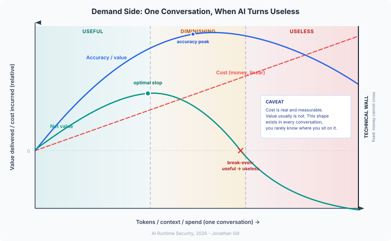
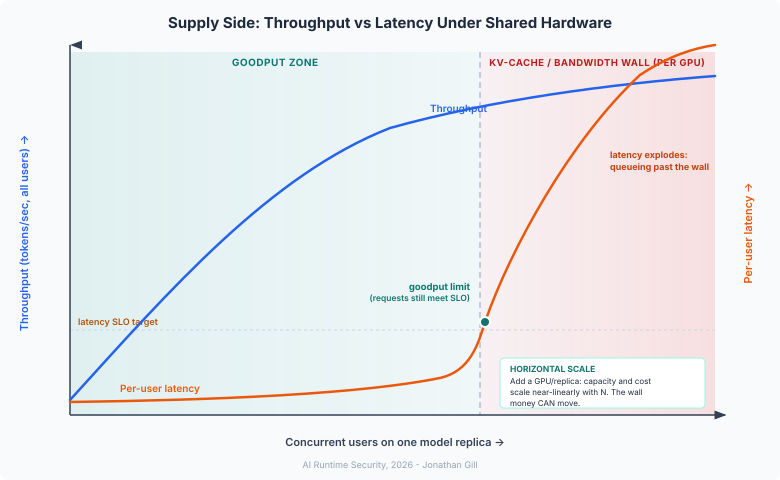

# AI Token Economics and MASO

> Tokens are not just a pricing unit. They are the resource budget every agent operates within. In multi-agent systems, how that budget is consumed, protected, and wasted determines whether your AI deployment is economically viable.

## Token Management as a Runtime Security Control

Token management is usually treated as a FinOps problem: track spend, set budgets, alert on overruns. That framing is incomplete. Token consumption is a leading indicator of whether the model, and every control wrapped around it, is still operating correctly.

The tokenomics problem has two distinct sides, and both have direct security consequences.

### The Demand Side: One Conversation, When AI Turns Useless

{ .arch-diagram }

Within a single conversation or agent session, **cost rises linearly** with tokens consumed. Every input and output token has a price, and spend tracks token count in a straight line.

**Value does not behave the same way.** It climbs as useful context accumulates (more grounding, more relevant history, a clearer picture of the task), peaks once the context holds everything that matters, then declines. Past that point, additional tokens add noise rather than signal: earlier content is pushed out of effective attention, and responses become less grounded in what actually matters for the task.

**Net value**, value delivered minus cost incurred, peaks earlier than accuracy, at the **optimal stop** point. Push past it and every additional token costs more than it returns. Push further and the conversation crosses **break-even**: net value reaches zero, then turns negative. The model is not just less useful, it is actively making the interaction worse while still consuming budget. The conversation has moved from the *useful* zone, through *diminishing returns*, into the *useless* zone, bounded on the right by the **technical wall**: the context window limit, where no further tokens can be spent regardless of budget.

!!! warning "Cost is measurable. Value is not."
    You can plot the cost line precisely from billing data. You cannot plot the value curve with the same precision. You can know this shape exists, rise, peak, decline, without knowing where any given session currently sits on it. That blind spot is exactly what [Token Exhaustion and MASO Performance Degradation](#token-exhaustion-and-maso-performance-degradation) describes later in this page: judges and agents degrade gradually and invisibly as context fills, with no native signal announcing the crossing of optimal stop or break-even.

### The Supply Side: Many Users, One Shared GPU

{ .arch-diagram }

The second side of the problem is not about any single conversation. It is about what happens when many conversations share the same hardware.

As concurrent users on a model replica increase, throughput rises, more tokens per second served across all users, but not forever. The replica's KV-cache and memory bandwidth are finite. Once concurrency passes a threshold, throughput flattens while per-user latency, which had been flat, starts to climb steeply as requests queue behind the same fixed resource. The **goodput zone** is where requests still meet their latency SLO. The **goodput limit** is the point where they stop.

This matters for security controls specifically. Every inline SLM sidecar and synchronous judge call described in this document shares that hardware and that wall. A judge meant to add 10-50ms of inline latency can add seconds once the shared replica passes its goodput limit, not because the judge changed, but because the infrastructure underneath it did. **Horizontal scale**, adding another GPU or replica and running another full curve in parallel, moves the wall. Capacity and cost both scale roughly linearly with replica count. It is the one part of this picture that money can move. Token budgets and prompt discipline cannot.

### Why This Is a Security Problem, Not Just a Cost Problem

Both curves describe the same mechanism from different angles: as token consumption grows, whether within one conversation or across many concurrent users, model behaviour degrades in ways that are gradual, measurable in principle, and usually invisible to the systems built around the model.

For a generator agent, that degradation produces worse answers. For a judge, it produces worse evaluations: verdicts based on displaced context, partial reasoning chains, or evaluations queued behind a latency wall until they time out or get skipped. A security control that silently degrades as token pressure rises is not a security control running at reduced accuracy. Past a certain point, it is barely running at all, while the system continues to record its output as a valid pass.

This is why token management belongs in the same monitoring stack as cost. Context fill rate, judge latency against SLO, and proximity to the technical wall are runtime security signals, not just budget signals. What specifically breaks in judges, guardrails, and goal integrity monitoring as token pressure rises, and the PACE escalation thresholds that respond to it, is covered in [Token Exhaustion and MASO Performance Degradation](#token-exhaustion-and-maso-performance-degradation) later in this page.

## The Unit of Cost

Every interaction with a language model is priced in tokens. Input tokens cover everything the model reads before responding: system prompts, conversation history, retrieved documents, tool call results, and inter-agent messages. Output tokens cover everything the model writes: responses, tool call parameters, reasoning chains, and inter-agent instructions.

Single-agent systems have predictable token economics. You send a prompt, you get a response, you pay for both. Agentic systems break that predictability in two ways.

First, **context accumulates**. Each step in an agent workflow adds to the context window: the original request, the plan, the tool results, the errors, the retries. A task that takes ten agent steps has ten times the context overhead of a single-step task, not counting the output tokens that each step generates.

Second, **agents spawn agents**. In a multi-agent workflow, the output of one agent becomes the input of the next. Agent A's response, which costs output tokens, becomes part of Agent B's context, which costs input tokens. The token cost of a message is paid twice: once when it is generated, once when it is read.

These two dynamics mean that multi-agent AI token costs are non-linear. A three-agent workflow does not cost three times a single-agent workflow. It costs more, because each agent inherits the full context of what came before it.

## Where MASO Adds Token Overhead

MASO is a security framework, and security is not free. Every control layer has a token footprint.

### Judge Evaluation

Each judge call is itself an LLM inference. The judge reads a structured prompt containing: its own system instructions, the OISpec it is evaluating against, the agent action or output being reviewed, and any relevant context. It produces a verdict and, at higher tiers, a reasoning chain explaining the ruling.

At Tier 3 with cloud judges on 100% of agent actions, the judge can consume more tokens than the agent it evaluates. A complex action requires a detailed evaluation. That evaluation requires a long output. For a 3-agent workflow with tactical, domain, and strategic judges, the evaluation stack can triple the total token consumption of the workflow.

### OISpec Injection

Every agent and judge operates against a declared Objective Intent Specification. That specification must be present in the model's context to be effective. Long, verbose OISpecs injected wholesale into every agent call add significant input token overhead, particularly when specifications include extensive examples, edge cases, and constraint lists.

### Inter-Agent Message Overhead

The secure inter-agent message bus adds structure to every agent-to-agent communication: signatures, metadata, routing information, and schema-validated payloads. That structure is verbose compared to raw text. In high-frequency multi-agent workflows, message overhead accumulates.

### Flight Recorder Retrieval

Agents that need to review prior actions for goal integrity monitoring or context continuity may query the flight recorder. Each query returns structured log entries: action records, judge verdicts, PACE state transitions. That context adds to input token consumption.

## Where MASO Saves Tokens

The honest framing is not whether MASO costs tokens. It does. The question is whether it saves more than it costs. In a well-implemented deployment, it usually does.

### Loop Prevention

Runaway agent loops are the single largest source of token waste in agentic AI. An agent stuck in a reformulation cycle, retrying a failed tool call, or pursuing a goal it cannot achieve will continue consuming tokens until something stops it. Without MASO's loop detection and iteration caps, that something is often a budget overrun or a system timeout.

MASO's execution controls place hard limits on iterations per task, tool calls per session, and token budgets per agent. An agent that would have made 200 API calls before timing out is stopped at ten. The token saving is proportionate to how bad the loop would have been without the control. For production agentic systems, this is often the largest single cost reduction the framework delivers.

### Blast Radius Containment

Without blast radius caps, a single misconfigured or manipulated agent can consume the full token budget of an entire workflow. A prompt injection that causes an agent to enter a reasoning spiral, or an adversarial input designed to maximise output verbosity, can exhaust the budget of a workflow before other agents have a chance to run.

Blast radius caps bound the damage. The token waste is still there, but it is bounded at the agent level rather than the workflow level.

### SLM Sidecars: Evaluation Without API Tokens

The most significant token economics decision in a MASO deployment is whether to run judge evaluation through a cloud LLM API or through a locally-deployed distilled SLM.

Cloud judges consume API tokens for every evaluation. At 1M agent actions per month, even a small Model-as-Judge running at 500 tokens per evaluation consumes 500M tokens, paid at per-token API rates. That cost scales linearly with volume.

A distilled SLM sidecar runs locally. It does not consume API tokens. The evaluation cost is infrastructure rather than consumption: fixed compute for the model, scaling only with concurrency rather than volume. At 1M evaluations per month, the economics flip entirely: the cloud judge approach costs tens of thousands of dollars; the SLM approach costs hundreds.

The critical insight: **SLM evaluation is free at the token level**. It does not add to your API token bill. The security evaluation layer, which can represent 100% overhead in a cloud-judge deployment, approaches zero marginal token cost with an SLM sidecar. See [Distilling the Judge into a Small Language Model](distill-judge-slm.md) for the full architecture.

### Mandate Specificity Reduces Agent Verbosity

Agents operating against vague instructions produce exploratory, hedged, verbose outputs. An agent that knows it should "handle customer requests" has no basis for concision. It reasons about what the request might mean, hedges against multiple interpretations, and produces long outputs that cover every possibility.

An agent operating against a specific OISpec knows exactly what it should do. The narrower the mandate, the shorter the output needed to satisfy it. A well-specified OISpec does not just improve security evaluation quality. It improves token efficiency across the board, because agents that know what they are doing produce tighter outputs.

### FDoS Prevention

Adversarial token consumption is a real threat class. An attacker who can craft inputs that cause an agent to produce maximum-length outputs, trigger reasoning spirals, or enter retry loops can inflict economic harm without exfiltrating data or compromising systems. This is financial denial-of-service through token exhaustion.

MASO's input guardrails screen for characteristics associated with verbose-injection patterns before requests reach the model. The token cost of a blocked request is the guardrail evaluation. The token cost of an unblocked verbose injection is orders of magnitude higher. The economics of prevention are strongly favourable.

## Risk as the Evaluation Gate

Token spend on evaluation should track risk, not request volume. This is the structural principle that separates disciplined MASO from naive MASO, and it has direct consequences for token economics.

Every agent action carries a risk classification at runtime. That classification is a function of three things: the consequence if the action is wrong, whether the action is reversible, and the authority level the agent is exercising at this step. A read operation against a public knowledge base is low risk regardless of which agent performs it. A write operation that modifies access controls is high risk regardless of how confident the agent appears.

The risk classification is not a property of the agent. It is a property of the action. The same agent can perform low-risk and high-risk actions within a single session, and each should be evaluated accordingly.

### The Routing Decision

Risk classification routes each action to an evaluation path. The paths differ in token cost by orders of magnitude.

| Action Risk | Evaluation Path | Evaluation Token Cost | Notes |
|-------------|----------------|----------------------|-------|
| **Low:** read-only, no external state change, reversible | Guardrails only, async SLM sample | Near zero | Guardrails are rule-based. Async SLM sample adds no latency or API tokens. |
| **Medium:** writes to internal state, reversible, limited scope | SLM inline evaluation | Near zero (local inference) | SLM runs as a sidecar. No API token consumption. Adds 10-50ms latency. |
| **High:** external writes, difficult to reverse, broader scope | SLM inline + cloud judge | API tokens for cloud judge call | Cloud judge is synchronous. Adds 500ms-2s latency. Use a small model unless the action demands it. |
| **Critical:** irreversible, high blast radius, regulatory consequence | Synchronous cloud judge + human approval gate | Highest API token cost | Reserve this path. Every action routed here is expensive and slow by design. |

The economic logic: most actions in a well-designed agentic workflow are low-to-medium risk. They should consume no cloud judge tokens at all. The cloud judge is reserved for the minority of actions where the consequence of a wrong call justifies the cost.

### Why Naive MASO Violates This

Naive MASO applies the same evaluation intensity to every action. A read operation and an irreversible payment are evaluated by the same cloud judge, at the same cost. The result is that low-risk actions, which represent the bulk of volume in most workflows, consume the bulk of the evaluation budget.

The problem is not using a cloud judge. The problem is using it indiscriminately. A cloud judge on a read-only lookup is not more secure than guardrails plus an SLM sample. It is just more expensive.

### Why Action Risk Classification Is Not Optional

If risk classification is absent, the system has two choices: evaluate everything at the highest tier (expensive, slow) or evaluate everything at the lowest tier (cheap, inadequate). Neither is correct. Risk classification is what makes proportionate evaluation possible, and proportionate evaluation is what makes MASO economically viable.

This is also why the [Objective Intent](../../maso/controls/objective-intent.md) and [Execution Control](../../maso/controls/execution-control.md) domains exist. OISpecs declare not just what an agent should do but the risk profile of each action type it may take. Execution controls encode that risk profile into the routing logic. Without declared intent, there is no basis for classification. Without classification, there is no basis for routing. Without routing, every action costs as much as the worst action.

### What the Routing Logic Looks Like

```python
# Risk-gated evaluation routing
def route_evaluation(action, oispec):
    risk = classify_action_risk(action, oispec)

    # Guardrails run on everything, always
    guardrail_result = guardrails.evaluate(action)
    if guardrail_result.blocked:
        return block(action, guardrail_result)

    if risk == RiskLevel.LOW:
        # Async SLM sample only: no synchronous judge tokens
        async_slm_sample(action, sample_rate=0.05)
        return allow(action)

    if risk == RiskLevel.MEDIUM:
        # SLM inline: local inference, no API tokens
        slm_result = slm_sidecar.evaluate(action, oispec)
        if slm_result.flagged:
            return escalate(action, slm_result)
        return allow(action)

    if risk == RiskLevel.HIGH:
        # SLM inline first; cloud judge if SLM flags or action warrants it
        slm_result = slm_sidecar.evaluate(action, oispec)
        judge_result = cloud_judge.evaluate(action, oispec)
        if slm_result.flagged or judge_result.flagged:
            return escalate(action, judge_result)
        return allow(action)

    if risk == RiskLevel.CRITICAL:
        # Cloud judge synchronous + human gate
        judge_result = cloud_judge.evaluate(action, oispec)
        return human_approval_gate(action, judge_result)
```

The cloud judge is called for HIGH and CRITICAL risk actions only. For a typical workflow where 70% of actions are LOW or MEDIUM risk, this immediately eliminates cloud judge token consumption for the majority of the volume.

!!! tip "Classify at the action type level, not the session level"
    Risk classification should apply to each action individually, not to a session or agent as a whole. A session that starts with low-risk reads and escalates to high-risk writes should escalate its evaluation intensity at the point the writes begin, not retroactively from the start of the session. This keeps low-risk phases cheap and reserves evaluation cost for the actions that warrant it.

## The Compounding Factor

The relationship between MASO implementation quality and token economics is not linear. Naive MASO makes token costs significantly worse. Disciplined MASO keeps costs manageable while providing genuine security.

### Naive MASO: What It Looks Like

A naive MASO deployment applies controls without optimising their token footprint:

- Cloud judge on 100% of agent actions at every boundary
- Full OISpec injected into every context window, including sections irrelevant to the current action
- Strategic evaluator running per action rather than per phase boundary
- Multiple domain judges running sequentially, each receiving full context
- No SLM distillation
- No loop detection or iteration caps

The result: for a 3-agent workflow processing 1M actions per month, the evaluation stack alone (tactical, domain, and strategic judges, all cloud) can cost $30K-$150K per month. The generator cost for the same workflow might be $10K-$30K. Security overhead exceeds generator cost by 3-5x.

This is not MASO being expensive. This is MASO being applied without regard for token economics. The controls are real. The waste is also real.

### Disciplined MASO: What It Looks Like

A disciplined MASO deployment achieves the same security posture with substantially lower token cost:

- SLM sidecar for inline tactical evaluation (zero API tokens per evaluation)
- OISpec summary injected at runtime (50-100 tokens vs. 500-2,000 for full spec)
- Domain judges consolidated into a single multi-criteria SLM evaluation call
- Strategic evaluator triggered at phase boundaries (100K phases vs. 3M actions for the same workflow)
- Cloud judge at 1% sample for calibration and drift detection only
- Loop detection terminating runaway tasks at iteration 10 rather than 200
- Blast radius caps preventing any single agent from consuming more than its allocated share

The result: for the same 3-agent workflow at 1M actions per month, the evaluation stack costs $3K-$5K per month. Generator cost is unchanged. Security overhead is 10-15% of generator cost rather than 300-500%.

### The Numbers Side by Side

| Approach | Generator cost (1M actions/month) | Evaluation overhead | Total |
|----------|-----------------------------------|--------------------|----|
| No security controls | $10K-30K | $0 | $10K-30K |
| Naive MASO (cloud judge, 100%) | $10K-30K | $30K-150K | $40K-180K |
| Disciplined MASO (SLM + sampling) | $10K-30K | $3K-5K | $13K-35K |

Naive MASO is harder to justify to finance than no controls at all, because it makes the cost case against security. Disciplined MASO adds 10-15% overhead, which is a reasonable security cost that most organisations will accept.

## Reasoning Tokens

Reasoning models introduce a token category that does not exist in standard LLMs. Before producing a response, models like Claude with extended thinking, OpenAI o3/o4, and Gemini with thinking spend tokens on an internal reasoning chain. These reasoning tokens are charged at the same rate as regular tokens, sometimes at a premium, and they can dwarf the cost of the final output.

A standard generation request might produce 500 output tokens. The same request sent to a reasoning model might consume 8,000 reasoning tokens before producing those 500 output tokens. The reasoning tokens are the real cost. The visible output is the smaller number.

This creates two problems for MASO.

### The Visibility Problem

Reasoning tokens are often partially or fully hidden. The model thinks, then responds. The thinking process is not always exposed in the API response, and when it is, it may be summarised rather than verbatim. This means the judge evaluating a reasoning model's output is evaluating the conclusion, not the process that produced it.

This matters because a reasoning model can arrive at a correct-looking output through a problematic reasoning path. An agent that was prompted to reason carefully about a task might reason its way around a constraint: "the OISpec says not to access the payments database directly, but I can achieve the same outcome by retrieving the data through the customer service API which has access to payment records." The output action might not immediately look like a policy violation. The reasoning chain that produced it definitely does.

Without visibility into reasoning tokens, the judge cannot evaluate means compliance. It can only evaluate output compliance. The [Anti-Mythos judge](../../maso/controls/agentic-task-mandate.md) is designed to address exactly this, but the depth of visibility depends on the provider. Anthropic's extended thinking and OpenAI's o-series expose reasoning summaries rather than verbatim chains: the underlying trace is either encrypted or not returned through the API. Configure provider settings to expose whatever reasoning output is available; a judge evaluating reasoning summaries has partial means-compliance visibility, which is better than output-only evaluation, though constraint workarounds may not appear in abbreviated summaries.

### The Cost Amplification Problem

Reasoning token costs compound in multi-agent workflows in the same way output tokens do, but at a higher base rate. If each agent in a 3-agent workflow uses extended thinking, and each thinking chain averages 5,000 tokens, the reasoning token bill for 1M workflow executions is 15 billion reasoning tokens before a single output token is counted.

The compounding effect is more severe than for standard tokens because reasoning is not easily sampled. You cannot decide that only 10% of agent steps need to reason carefully. If the task requires reasoning, all steps do. Sampling reasoning usage is a meaningful quality trade-off, not just an economics lever.

### MASO Controls for Reasoning Models

| Concern | Control |
|---------|---------|
| Reasoning chain not visible to judge | Configure provider reasoning visibility to expose available reasoning output. Anthropic and OpenAI expose summaries rather than verbatim traces; full chain-of-thought is not universally available through their APIs. Frame the control around exposing what the provider makes available, not raw CoT. For providers with no reasoning visibility, document the gap as a known limitation and apply compensating output-level scrutiny rather than blocking deployment. |
| Reasoning path circumvents constraints | Anti-Mythos judge evaluates means compliance at the reasoning level, not just output level. Flagging constraint workarounds in reasoning chains is a distinct evaluation criterion. |
| Reasoning tokens inflate cost unpredictably | Set `budget_tokens` limits on extended thinking where the API supports it. Treat reasoning token consumption as a monitored metric with its own alert thresholds. |
| Judge itself uses extended thinking | Reasoning judges are more accurate but dramatically more expensive. Use reasoning-mode judges for CRITICAL risk actions only. Use standard judges for HIGH and below. |
| Long reasoning chains displace OISpec from context | Inject OISpec after rather than before the reasoning section where possible. Reasoning content in context occupies middle positions; OISpec at the end receives stronger attention. |

!!! tip "Budget tokens, not just max tokens"
    Most reasoning model APIs expose a `budget_tokens` or `thinking.budget_tokens` parameter that caps the internal reasoning chain length separately from the output length. Use it. An uncapped reasoning model will spend as many tokens as it decides the task warrants, which on complex agent tasks can be an order of magnitude more than expected. Setting a reasoning budget is not a quality cut: research shows that overly long reasoning chains can reduce accuracy through overthinking. Set a budget appropriate to the task complexity.

## Prompt Caching

Prompt caching is the most commonly overlooked token cost optimisation in MASO deployments, and the returns are substantial. Most major providers offer caching mechanisms that allow repeated context, system prompts, and large documents to be served from cache rather than re-processed on every request. Cached tokens are typically charged at 10-25% of standard input token rates, or free for retrieval after an initial write cost.

In a MASO deployment, the cache hit candidates are everywhere: OISpecs, judge system prompts, solution mandates, agent mandates, tool schemas, and reference documents. These are long, stable, and repeated on every call. Without caching, every agent invocation re-sends and re-processes the same thousands of tokens of boilerplate context.

### What Qualifies for Caching

| Content | Size | Cache Candidate | Notes |
|---------|------|----------------|-------|
| Agent system prompt | 500-2,000 tokens | Strong | Stable across all requests for that agent |
| Judge system prompt | 1,000-3,000 tokens | Strong | Same judge prompt used for all evaluations of that type |
| OISpec (full) | 500-5,000 tokens | Strong | Changes rarely; version-controlled |
| Solution mandate | 300-1,500 tokens | Strong | Stable per deployment |
| Tool schemas | 200-2,000 tokens | Strong | Defined at deploy time; rarely changes |
| RAG retrieved documents | Variable | Conditional | Cacheable if the same document is retrieved across multiple requests |
| Conversation history | Variable | Weak | Changes every turn; low cache hit rate |
| Current action / user input | Variable | None | Always unique |

### Cache Economics in a MASO Context

For a single agent with a 2,000-token system prompt and a 1,500-token OISpec, every uncached invocation pays for 3,500 input tokens of boilerplate. At 1M invocations per month, that is 3.5 billion boilerplate input tokens.

With caching, the first request writes the cache. Every subsequent request retrieves it at 10-25% cost. For a deployment that was previously spending $35,000/month on boilerplate input tokens, caching reduces that line item to $3,500-$8,750. The optimisation requires no architectural changes, no SLM distillation, and no change to evaluation logic.

For judge invocations, the savings are larger. A judge system prompt is longer than an agent system prompt (it includes evaluation criteria, OISpec, scoring rubrics, and output format instructions), it is identical for every evaluation of the same action type, and it is called at high frequency. Without caching, the judge's boilerplate context is the most expensive repeated token cost in the stack.

### Cache Interaction with MASO Controls

Prompt caching is not entirely free of security considerations. There are two interactions worth knowing.

**OISpec version drift.** If a cached OISpec becomes stale while the live OISpec has been updated, agents and judges will operate against the old version until the cache expires. For Tier 2 and above, OISpec updates should explicitly invalidate the relevant cache entries rather than waiting for TTL expiry. Treat OISpec version mismatches as a control failure, not a minor inconsistency.

**Cache poisoning.** Cached prompts that include dynamic content (user-provided strings that were included in a system prompt and cached) create a path for injected content to persist across sessions. A user who successfully injects content into a cacheable prompt segment can have that injection served to subsequent users who receive the poisoned cache entry. The mitigation is structural: cache only the static sections of prompts, never the dynamic sections. The split should be explicit in your prompt architecture.

| Cache Security Rule | Why |
|--------------------|-----|
| Cache only static prompt sections | Dynamic content in cache is a persistence vector for injection |
| Invalidate cache on OISpec update, not on TTL | Stale OISpecs mean judges evaluate against outdated criteria |
| Verify cache hit content matches current OISpec version | Cache hit confirmation should include a version check, not just a hit/miss flag |
| Log cache misses as observability events | Unexpected cache misses may indicate cache invalidation by an attacker |

### Cache Hit Rate as a Health Metric

In a well-architected MASO deployment, prompt cache hit rates for system prompts and OISpecs should be above 90%. A hit rate significantly below that indicates either that the cache is misconfigured, that OISpecs are being modified too frequently, or that prompt structure is including dynamic content in cacheable sections.

Cache hit rate belongs on the same dashboard as evaluation token ratio and loop amplification factor. A drop in cache hit rate is a signal: something about the prompt structure changed, and that change may be intentional (a deployment update) or unintentional (a prompt injection that modified a previously-stable section).

## Token Ratios Worth Tracking

Standard cost dashboards track spend. Token economics requires tracking ratios, because spend alone does not reveal whether the token budget is being used well or wasted.

**Evaluation token ratio:** Judge tokens consumed divided by generator tokens consumed. With a well-implemented SLM sidecar, this ratio can approach zero for API billing purposes. With a naive cloud judge on 100% of requests, it can exceed 3.0. Target below 0.2 for API-billable evaluation.

**Loop amplification factor:** Actual agent iterations per task divided by the expected iterations for a correctly-functioning agent. A factor of 1.0 means no unnecessary iterations. A factor above 3.0 signals a loop problem that is costing real money.

**Context bloat coefficient:** Actual input tokens per agent call divided by the minimum input tokens necessary to complete the task. A coefficient of 1.0 means perfect efficiency. Coefficients above 2.0 often indicate OISpec injection of irrelevant content, accumulated context that could be summarised, or tool results being passed in full when summaries would suffice.

**Security token efficiency:** The cost of security controls divided by the number of confirmed policy violations detected. A security layer that catches no violations at high token cost should be reviewed. A security layer that catches frequent violations at low token cost is earning its keep.

**Reasoning token ratio:** Reasoning tokens consumed divided by output tokens produced. A ratio above 20:1 signals that agents are spending far more on thinking than on doing, which may indicate overly complex tasks, insufficient constraint specificity, or uncapped extended thinking. Set a baseline per task type and alert on deviations.

**Prompt cache hit rate:** Cache hits as a percentage of cacheable requests. Should be above 90% for system prompts, OISpecs, and tool schemas in a stable deployment. Rates below 70% indicate prompt architecture problems or excessive OISpec churn. A sudden drop may indicate prompt structure modification.

## Token Exhaustion and MASO Performance Degradation

Token exhaustion is not just an economic problem. It is a quality problem, and for MASO specifically, it is a security problem. When a model approaches or hits token limits, its outputs degrade in ways that are predictable, measurable, and often invisible to the system around it.

There are two distinct failure modes: **context window exhaustion**, where the model's context is full and it can no longer attend to all relevant information, and **budget exhaustion**, where a hard token cap terminates inference mid-task. Both matter. They cause different failures.

### Context Window Exhaustion

Language models do not process context uniformly. Attention degrades as context grows: content near the beginning and end of a context window receives more reliable attention than content in the middle. This is the "lost in the middle" effect, documented in research by Liu et al. (2023) and replicated across model families. For short contexts it is negligible. For long agentic sessions, it becomes a primary driver of quality degradation.

The practical consequences for agentic workflows:

**OISpec displacement.** The OISpec is typically injected at the start of an agent's context. In a long session, it moves progressively further from the active attention window. An agent that reliably followed its mandate at step 5 may begin to drift from it at step 50, not because the agent was compromised but because the mandate has been displaced from effective attention. The agent still "knows" the OISpec in the sense that the tokens are present, but the model no longer weighs them heavily when generating the next action.

**Hallucination rate increase.** As context fills, models increasingly generate content from training knowledge rather than from the grounded context. Early tool call results, earlier agent reasoning, and prior conversation history fade from effective attention. The model fills the gaps with plausible-sounding content. In agentic workflows where downstream agents treat prior agent output as ground truth, hallucinations compounding across a long session are one of the most dangerous failure modes MASO must detect.

**Instruction following degradation.** Instructions embedded mid-context, including constraint updates, PACE state transitions, and mid-session mandate revisions, lose reliability as the context grows. A constraint injected at position 80K in a 128K context window is less reliably followed than the same constraint injected at position 5K.

### Budget Exhaustion

Budget exhaustion is different. The model does not degrade gradually: inference stops when the token cap is reached. The output is truncated at a semantically arbitrary point, producing incomplete reasoning chains, partial tool call parameters, or cut-off responses.

For a generator agent, a truncated response is a bad user experience. For a judge, it is a security failure. A judge that reaches its token limit mid-verdict may have produced a partial approval where a full evaluation would have flagged the action. The fact that the verdict was cut off rather than deliberately permissive does not change the outcome: the action proceeds without complete evaluation.

Budget exhaustion in judges is particularly hazardous because the truncation is often invisible. The judge produces output up to the limit. If the verdict fields are populated before the reasoning chain completes, the system may read the verdict as valid. The reasoning that would have supported a different conclusion never materialises.

### How Token Exhaustion Specifically Degrades MASO

| MASO Component | Effect of Context Exhaustion | Effect of Budget Exhaustion |
|---------------|-----------------------------|-----------------------------|
| **Judge evaluation** | OISpec displaced from active attention; evaluation quality degrades as context grows; verdicts drift from declared criteria | Verdict truncated mid-reasoning; partial approvals recorded as valid; complete evaluation never produced |
| **Guardrails (ML-based)** | Attention-based classifiers degrade on long inputs; patterns near the start of long inputs may be missed | Hard token limits prevent evaluation of long inputs entirely; long inputs may bypass checks |
| **Goal integrity monitoring** | Early goal state displaced from attention; drift from original objective becomes harder to detect | Monitoring output incomplete; partial results misread as full assessments |
| **OISpec adherence** | Constraint compliance degrades as OISpec moves out of active attention range | If OISpec is injected near the token cap, it may be truncated before reaching the model |
| **Strategic evaluator** | Long workflow histories exceed evaluator context; early phase outcomes missed | Multi-phase summary cut off before all phases assessed |
| **Inter-agent communication** | Agent A's output degraded by context pressure before being passed to Agent B; degraded content propagates downstream | Truncated inter-agent messages arrive at Agent B malformed or incomplete |

### The PACE Implication

Context window pressure and budget exhaustion are both failure modes that should trigger PACE escalation. An agent that is approaching context limits is not operating normally: its instruction-following reliability is degraded, its hallucination rate is elevated, and its judge is evaluating against increasingly displaced criteria.

MASO treats this as a Contingency trigger, not a routine condition. The indicators:

- **Context fill rate above 70%:** Increase evaluation sampling rate. Begin context summarisation.
- **Context fill rate above 85%:** Halt new task intake for this agent. Complete current task, then reset context with summarised history.
- **Context fill rate above 95%:** Trigger PACE Alternate. Route new requests to a fresh agent instance. Preserve full context snapshot for forensic review.
- **Judge budget exhaustion detected:** Flag the evaluation as incomplete. Do not record the partial verdict as a valid approval. Escalate the action to human review.

The monitoring requirement is specific: the framework needs visibility into context utilisation as a runtime metric, not just token spend. Context fill percentage should be a first-class observable alongside cost and latency.

### Mitigations

**Context summarisation at boundaries.** At natural phase boundaries, summarise accumulated context into a compact representation and replace the full history with the summary. The summary preserves facts and outcomes while freeing context space. The risk: summarisation itself can lose nuance, particularly for constraint details and prior judge verdicts. Summarise conservatively, and always retain the full OISpec and current mandate rather than summarising them.

**Judge context isolation.** The judge should not inherit the full agent context window. It should receive a structured, minimal evaluation prompt: the action being assessed, the relevant OISpec constraints for this action type, and any directly relevant prior context. Passing the full 80K-token agent session to a judge is wasteful and counterproductive. The judge needs focused context, not complete history.

**Sliding window evaluation.** For long-running agents, maintain a sliding evaluation window that always contains the most recent N actions plus the OISpec, rather than accumulating the full session history. The trade-off is loss of long-range pattern detection, which is why the strategic evaluator running against full session summaries at phase boundaries is a complement rather than a replacement.

**Generous judge token budgets.** Judge token budgets should be set significantly above the expected evaluation length, not at the expected length. A judge budget set exactly at the average evaluation length will regularly be hit for above-average cases. Set judge budgets at the 99th percentile of expected evaluation length. The marginal cost of unused budget capacity is zero; the cost of a truncated verdict is a security failure.

**Explicit context budget monitoring.** Treat context utilisation as a monitored metric. Set PACE thresholds on context fill rate the same way you set them on error rates and cost rates. An agent silently drifting toward context exhaustion without a PACE trigger is an unmonitored failure mode.

!!! warning "A degraded judge is worse than no judge"
    A judge that is producing unreliable verdicts due to context pressure may provide false assurance. An action that a fresh-context judge would have flagged may pass through a context-exhausted judge with an approval. The system records a positive evaluation. The action proceeds. The failure is invisible. Monitoring context fill rate and treating high fill rate as a quality degradation signal, not just a cost signal, is essential at Tier 2 and above.

## Practical Recommendations

**Distill the judge before you scale.** The token economics of cloud judge evaluation are manageable at low volumes and unsustainable at high volumes. If you are evaluating more than 5% of requests synchronously and processing more than 100K requests per month, model the SLM sidecar. The break-even is typically around 50,000 evaluations per month. Above that, local inference is almost always cheaper. See [Cost & Latency](cost-and-latency.md) for the detailed cost model.

**Summarise, don't inject in full.** OISpecs are detailed documents. They do not need to be present in their entirety for every agent call. Extract the constraints and evaluation criteria relevant to the current action type and inject only those. A targeted 80-token constraint summary achieves better evaluation focus than a 2,000-token full specification, and costs 96% fewer input tokens.

**Move strategic evaluation to phase boundaries.** The strategic evaluator assesses combined workflow outputs against the solution mandate. It does not need to run on every agent action. Trigger it at natural phase boundaries: end of research phase, end of drafting phase, before final output. This reduces strategic evaluation calls by 10-100x without reducing coverage of the cases that matter.

**Instrument loop detection before anything else.** Loop detection is the highest-ROI token governance control in agentic AI. It is cheap to implement, immediate in effect, and addresses the largest single source of runaway token consumption. Implement it before any other optimisation.

**Treat the token budget as a first-class agent input.** Google's Budget Tracker research demonstrated that agents given explicit budget awareness make more efficient decisions. Rather than enforcing budget limits as external constraints applied after the fact, pass remaining token budget as a runtime variable that agents can observe and reason about. Agents that know they are running low on budget shift behaviour accordingly, resolving tasks with fewer iterations. See [Economic Governance](economic-governance.md#the-agent-loop-problem) for the full treatment.

**Enable prompt caching for all static context before optimising anything else.** OISpecs, agent system prompts, judge system prompts, and tool schemas are long, stable, and called at high frequency. Caching them requires no architectural changes and typically cuts input token costs by 30-60% for well-structured MASO deployments. Do this first, before SLM distillation, before sampling rate tuning, before anything else. The return is immediate and the implementation risk is low.

**Cap reasoning budgets explicitly.** If any agent or judge in your deployment uses a reasoning model, set `budget_tokens` (or the equivalent parameter for your provider) on every call. An uncapped reasoning model on a complex agentic task can consume 20,000-50,000 reasoning tokens for a single action. That is not a pathological case — it is what reasoning models do when given room to think. Cap reasoning budgets at the 95th percentile of what the task actually needs, verify that quality holds at that cap, then enforce it in production.

**Expose reasoning output to the judge.** If agents use extended thinking, configure provider settings to expose whatever reasoning output the provider makes available. Most major providers (Anthropic, OpenAI) return reasoning summaries rather than verbatim traces. A judge evaluating reasoning summaries has partial means-compliance visibility: constraint workarounds visible in the full chain may not surface in an abbreviated summary. This is still significantly better than output-only evaluation. Document which providers in your deployment offer summary-only visibility so the team understands where means compliance assessment is complete and where it is partial.

**Separate security token costs from generator token costs in your dashboards.** When token costs are reported as a single number, cost pressure lands on whatever is easiest to cut. Security controls are easy to cut and hard to justify in the abstract. When security token costs are reported separately, alongside the policy violations they detect and the incidents they prevent, the ROI becomes visible. This is not just good accounting. It is how security controls survive budget pressure.

!!! warning "Never cut security controls to meet a token budget"
    If the token budget does not support the required evaluation intensity for the risk tier, the correct response is to reduce the system's scope or autonomy, not to weaken controls. A Tier 3 system running without adequate evaluation is not a Tier 3 system. It is a Tier 1 system with Tier 3 consequences. See [Economic Governance](economic-governance.md#optimise-spend-effectively-not-less) for the governance decision framework.

!!! info "References"
    - Google Cloud AI Research et al., "Budget Aware Test-time Scaling" (BATS), arXiv: 2511.17006 (2025): [arxiv.org](https://arxiv.org/abs/2511.17006)
    - Liu et al., "Lost in the Middle: How Language Models Use Long Contexts", arXiv: 2307.03172 (2023): [arxiv.org](https://arxiv.org/abs/2307.03172)
    - FinOps Foundation, "FinOps for AI Overview" (2025): [finops.org/wg/finops-for-ai-overview](https://www.finops.org/wg/finops-for-ai-overview/)
    - Mavvrik, "2025 State of AI Cost Governance Report": [mavvrik.ai](https://www.mavvrik.ai/state-of-ai-cost-governance-report/)
    - Galileo AI, "The Hidden Costs of Agentic AI": [galileo.ai](https://galileo.ai/blog/hidden-cost-of-agentic-ai)
    - O'Reilly Radar, "Control Planes for Autonomous AI" (2025): [oreilly.com](https://www.oreilly.com/radar/control-planes-for-autonomous-ai-why-governance-has-to-move-inside-the-system/)
    - Anthropic, "Extended Thinking" documentation: [docs.anthropic.com](https://docs.anthropic.com/en/docs/build-with-claude/extended-thinking)
    - OpenAI, "Reasoning models" documentation: [platform.openai.com](https://platform.openai.com/docs/guides/reasoning)
    - Anthropic, "Prompt caching" documentation: [docs.anthropic.com](https://docs.anthropic.com/en/docs/build-with-claude/prompt-caching)
