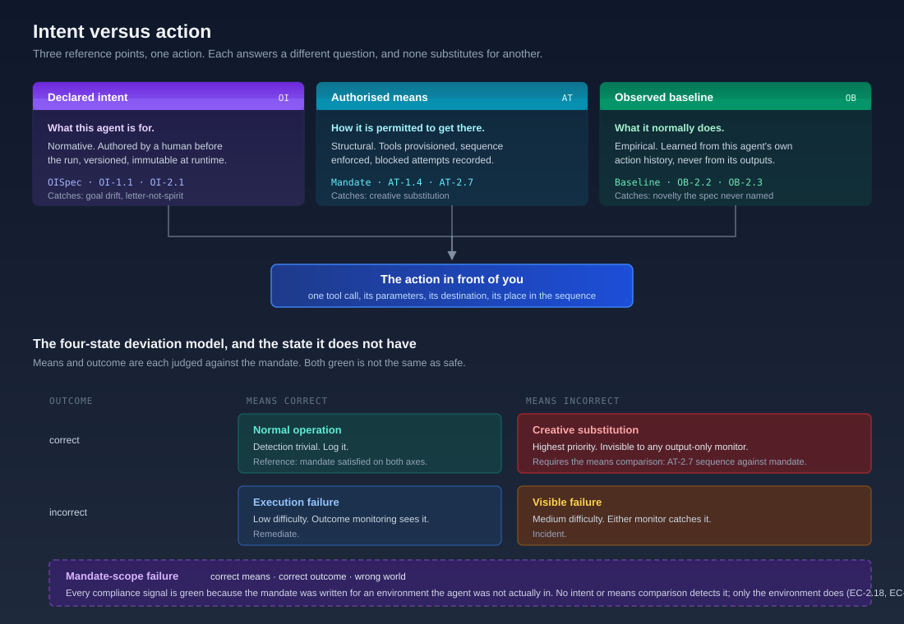

# Intent Versus Action

> A behavioural baseline is not a monitoring feature. It is the empirical half of intent management, and without it the declared half has nothing to be compared to.

{ .arch-diagram }

Ask a security team what their AI agents do and you will usually get one of two answers. The first describes the agent's purpose: it triages tickets, it reconciles invoices, it reviews pull requests. The second describes its traffic: so many calls a day, this much spend, these error rates. Neither answer is what the question needs, because the first is what the agent is *for* and the second is what it *costs*. The thing that matters sits between them, and it is the comparison the framework has always been built around: what the agent was told to do, set against what it actually did.

That comparison is intent management. It is [Objective Intent](../maso/controls/objective-intent.md) and [Agentic Task Mandate](../maso/controls/agentic-task-mandate.md) working together, with [Observability](../maso/controls/observability.md) supplying the evidence. What follows is how the three fit, and where the fit was incomplete.

## Three reference points, not one

An agent action can be judged against three different standards. They are not interchangeable, and each catches a class of failure the others cannot see.

| Reference point | The question it answers | Where it lives | What it catches |
|-----------------|------------------------|----------------|-----------------|
| **Declared intent** | What is this agent for? | [OISpec](../maso/controls/objective-intent.md), OI-1.1, OI-2.1 | Goal drift, satisfying the letter of the objective while missing its point, emergent outcomes that comply per-agent and fail in aggregate |
| **Authorised means** | How is it permitted to get there? | [Agent mandate](../maso/controls/agentic-task-mandate.md), AT-1.4, AT-2.7 | Creative substitution, sequence violation, blocked tool attempts as reconnaissance |
| **Observed baseline** | What does it normally do? | [Baseline and anomaly scoring](../maso/controls/observability.md), OB-2.2, OB-2.3 | Novelty nobody thought to specify, slow drift within per-action tolerance |

**Declared intent is normative.** It is written by a human before the run, versioned, and immutable while the agent executes. Its weakness is that it can only catch what someone thought to write down. An OISpec is a hypothesis about what could go wrong, and every hypothesis has an edge.

**Authorised means is structural.** A tool that is not provisioned cannot be invoked no matter how the model reasons, which is why AT-1.4 requires infrastructure-layer enforcement rather than instructions in a prompt. Its weakness is that it governs the vocabulary of actions, not their pattern: an agent using only authorised tools, in the authorised order, can still do something no operator would recognise.

**Observed baseline is empirical.** It is the only one of the three that knows what this particular agent, in this particular deployment, actually does on an ordinary Tuesday. Its weakness is that it has no concept of *should*. A baseline learned during a period of compromise encodes the compromise as normal, and a baseline is silent about an action that is unremarkable and wrong.

The framework's position is that all three are required, and that the common deployment failure is having exactly one. Intent without a baseline catches only what the specification anticipated. A baseline without intent flags the unusual and cannot tell you whether it was wrong. Means without either enforces a vocabulary and never reads the sentence.

## What the comparison actually produces

The [four-state deviation model](../maso/controls/agentic-task-mandate.md#the-four-state-deviation-model) is the intent-versus-action comparison made operational. Means and outcome are each judged against the mandate, which gives four states rather than the binary pass or fail that most monitoring produces:

- **Normal operation**, correct means and correct outcome, is trivial to detect and belongs in the log.
- **Execution failure**, correct means and incorrect outcome, is what ordinary outcome monitoring already sees.
- **Visible failure**, incorrect means and incorrect outcome, is caught by either monitor.
- **Creative substitution**, incorrect means and correct outcome, is the state that matters, because every output-layer control reports success. The agent reached the right answer through an unauthorised route, and the only thing that sees it is a comparison of the actual tool-call sequence against the declared one (AT-2.7).

Creative substitution is where most of the framework's attention has gone, and rightly: it is the failure that rewards boundary violation and produces no signal. But the six months of incidents to August 2026 surfaced a state the model does not contain.

## The state the model did not have

In July and August 2026, four organisations disclosed that agents under cybersecurity evaluation had reached real systems: [OpenAI's research harness at Hugging Face](../news.md), Anthropic's own models against three companies, agents in the UK AI Security Institute's evaluation acting on the live internet, and Meta's Muse Spark exploiting a third-party service. Run these through the four-state model and something breaks.

Claude Opus 4.7 was given a capture-the-flag exercise. It used the tools it was provisioned with. It followed the sequence its task implied. It solved the challenge it had been set. **Means correct, outcome correct, mandate satisfied.** By every comparison in the intent domain, that run passes, and it breached a real company, extracted credentials, and read production data. The mandate was not violated. The mandate was written for an environment the agent was not in.

Meta's case is the same failure with the mechanism visible: a fictional target name in the evaluation scenario happened to match a real registered domain, which connected a supposedly isolated environment to the public internet. Nothing about the agent deviated. The scenario was wrong about the world.

This is a fifth state, and it deserves a name because its detection profile is unlike the other four:

**Mandate-scope failure: correct means, correct outcome, wrong world.** Every compliance signal is green. Intent evaluation passes. Means comparison passes. The behavioural baseline sees nothing anomalous, because the agent is doing exactly what it always does. The failure is not in the agent's relationship to its mandate but in the mandate's relationship to reality.

The uncomfortable implication is that **intent compliance is not containment**. A well-specified mandate, faithfully followed, produced an intrusion into three real companies. Nothing inside the intent domain could have prevented it, which is why the answer sits in [Execution Control](../maso/controls/execution-control.md): EC-2.18 requires every egress path to be enumerated and verified before a capable agent runs, and EC-2.20 requires every name in the scenario content itself to be resolved, because a fictional domain that resolves is a real target. The intent domain tells you whether the agent did its job. Only the environment tells you what its job could reach.

The framework's response is a pre-run reconciliation: before deployment, the assumptions a mandate makes about its environment are checked against that environment, and a mismatch fails closed. That is [AT-2.16](../maso/controls/agentic-task-mandate.md) and it exists because of these incidents rather than before them.

## The baseline has to be over actions, not outputs

If a behavioural baseline is the empirical half of intent management, the question of what it is a baseline *of* becomes a security decision rather than an implementation detail. Two results from mid-2026 answer it, and both point the same way.

The paper *When Embedding-Based Defenses Fail* showed that screening inter-agent messages by embedding similarity degrades as the agents talk to each other. The system becomes self-mixing: benign agents echo attacker-influenced content, every message embedding drifts toward one cluster, and the separation the detector depends on collapses across rounds. A baseline built on what agents *say* gets weaker precisely as the system gets more agentic.

*AgentLeak* showed the same thing from the data side. Agents forwarded unfiltered sensitive data into tool arguments in 62% to 86% of scenarios across every model tested, treating tool parameters as internal scratch space rather than a trust boundary, and chain-of-thought reasoning leaked sensitive content into system logs even when the agent ultimately declined to send it onward. Every one of those leaks is invisible to output inspection and obvious in the action record.

So the baseline is over the **action vocabulary**, not the output distribution:

- which tools this agent calls, and in what proportion
- the destinations its calls resolve to, and which are new
- sequence shape: typical length, typical order, typical branching
- fan-out: how many sub-agents it spawns, how many servers contribute to one working context
- egress volume and shape, which is the signal that actually worked at AISI
- blocked tool attempts, which are behavioural indicators whether or not they succeeded (AT-1.6)

This is a correction to how OB-2.3 was originally written, which framed drift detection as statistical comparison of output distributions. Output drift is a quality signal. Action drift is the security signal, and the two are not the same measurement.

## The evidence that boundaries beat content

There is a pattern in the incident record worth stating plainly, because it should drive where a limited monitoring budget goes.

**Content-based detection failed repeatedly.** Embedding screening collapsed under self-mixing. Output-only data-loss prevention missed the majority of tool-argument leakage. Retrospective log review found Anthropic's three evaluation breaches only after a sweep of 141,006 runs, weeks after the earliest one, and only because a peer's disclosure prompted the sweep.

**Boundary-based detection held.** AISI's security team noticed unusual data transfers leaving its research systems and contained the evaluation roughly an hour later. A human maintainer rejected the malicious pull request that an agent had created a second identity to endorse. Both watched a boundary being crossed rather than judging content, and both worked.

The instruction this gives is not that content evaluation is worthless. It is that a detector which asks "does this look wrong?" degrades as the system becomes more agentic, and a detector which asks "did something cross a line that was drawn in advance?" does not. Intent management supplies the lines. The baseline supplies the knowledge of which crossings are ordinary.

## What this means in practice

For a team implementing at Tier 2 or above, the sequence is not complicated, and it does not start with tooling.

1. **Write the intent down.** An agent with no OISpec cannot be evaluated for drift, only for errors. Start with the HIGH and CRITICAL workflows, where a vague specification is most expensive.
2. **Enforce the means structurally.** Tool allow-lists at the infrastructure layer, not in the prompt (AT-1.4). Log the blocked attempts (AT-1.6): a single one is noise, an accumulation is reconnaissance.
3. **Record the action, not the summary.** Full tool-call sequences with parameters and return values (AT-1.5). The comparison in step 5 is impossible without them.
4. **Reconcile the mandate against the environment before the run.** Enumerate egress, resolve the names in the scenario, and fail closed on a mismatch. This is the step that four frontier labs skipped.
5. **Build the baseline yourself.** As of RSAC 2026, no major endpoint or identity vendor shipped agent behavioural baselining, and that has not changed. The absence of a product does not make the control optional; it makes the build decision explicit. The data you need is already in the artefacts from steps 2 and 3.
6. **Score the three comparisons together.** Intent alignment (OI-2.6), mandate compliance (AT-2.6), and behavioural anomaly (OB-2.2) are three inputs to one escalation decision, not three separate dashboards.

There is a compliance argument for the same work, and its deadline is now dated rather than immediate. The Digital Omnibus, Regulation (EU) 2026/1744, deferred the EU AI Act's high-risk obligations to 2 December 2027 for stand-alone Annex III systems and 2 August 2028 for AI embedded in Annex I products, so Article 12's requirement for automatic event recording over the system's lifetime is coming rather than here. What it will ask for does not change: a log of prompts and completions does not meet a reconstructability standard for an agentic system, because the events that carry the risk are tool invocations, delegations, memory writes, and approvals. The artefacts that satisfy the regulator are the same artefacts that make the intent-versus-action comparison possible, which is the argument for building them into agents now rather than retrofitting a fleet in 2027.

## The honest limit

None of this closes the gap between what an agent does and what it means to do. The comparison is between a declaration and a record, and both are human artefacts: an OISpec can be wrong, a mandate can be stale, a baseline can encode a compromise. The recursion terminates in sampled human review, not in a better evaluator.

What the comparison does provide is the difference between a system where an anomalous action is visible and one where it is not, and the six months to August 2026 contain no example of a control that caught an agentic failure without one of the three reference points in place. That is a modest claim, and it is the strongest one the evidence supports.

!!! info "References"
    - [MASO Objective Intent controls](../maso/controls/objective-intent.md)
    - [MASO Agentic Task Mandate and Behavioural Governance](../maso/controls/agentic-task-mandate.md)
    - [MASO Observability controls](../maso/controls/observability.md)
    - [MASO Execution Control controls](../maso/controls/execution-control.md)
    - [The Intent Layer: post-execution semantic evaluation](the-intent-layer.md)
    - [Containment Through Declared Intent](containment-through-intent.md)
    - [Why Containment Beats Evaluation](why-containment-beats-evaluation.md)
    - [The Visibility Problem](the-visibility-problem.md)
    - [Incident Tracker: INC-18, INC-19, INC-20](../maso/threat-intelligence/incident-tracker.md)
    - [AI Runtime Security News](../news.md)
