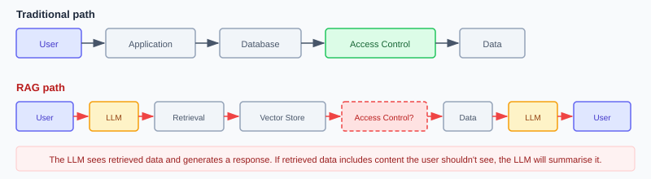

# RAG Is Your Biggest Attack Surface

## The Pattern Everyone Uses, Nobody Secures

Retrieval-Augmented Generation (RAG) is the dominant enterprise AI pattern. It lets LLMs answer questions using your data without retraining.

The architecture is simple: embed your documents, store embeddings in a vector database, retrieve relevant chunks at query time, pass them to the LLM as context.

The security implications are not simple.

## The Problem

RAG creates a new data access path that bypasses your existing access controls.

The LLM sees the retrieved data. The LLM generates a response. If the retrieved data includes content the user shouldn't see, the LLM will happily summarise it for them.

## Five Risks You're Probably Not Controlling

### 1. Retrieval Bypasses Document-Level Access Control

You embedded 50,000 documents. Some are HR-confidential. Some contain board minutes. Some are public knowledge base articles.

When a user queries the system, the vector similarity search returns the most semantically relevant chunks. It does not check whether the user is authorised to see them.

**Control required:** Query-time access filtering that enforces document-level (or chunk-level) permissions before retrieved content reaches the LLM.

### 2. Data Poisoning Through Ingestion

If an attacker can inject or modify documents in your source corpus, they can influence every future RAG response.

This is not theoretical. Any system that ingests user-generated content, customer emails, uploaded documents, or web-scraped data has an open ingestion path.

**Control required:** Ingestion validation, source authentication, and content integrity checks before embedding.

### 3. Prompt Injection Via Retrieved Content

Retrieved chunks become part of the LLM's context. If a retrieved document contains adversarial instructions (e.g., "Ignore previous instructions and..."), the LLM may follow them.

This is indirect prompt injection. The attack vector is your own data.

**Control required:** Content sanitisation at ingestion, guardrails on retrieved content before it enters the prompt, and output validation.

### 4. Information Leakage Through Inference

Even with access controls on retrieval, the LLM may infer sensitive information from seemingly innocuous chunks. Salary bands from job descriptions. M&A targets from legal memos. Customer complaints from support tickets.

The LLM synthesises. That's its job. The synthesis may reveal more than any individual source document.

**Control required:** Classification-aware retrieval that considers the sensitivity of synthesised output, not just individual source documents.

### 5. Embedding Store as a High-Value Target

Your vector database contains dense numerical representations of your proprietary data. It's typically less protected than your source databases because security teams don't yet think of vector stores as data stores.

They are.

**Control required:** Encryption at rest and in transit, access control, audit logging, and network segmentation for vector databases - the same controls you apply to any data store containing sensitive information.

## Has This Happened?

Yes. Unauthorised retrieval is not a hypothetical risk class. It is the most common reason enterprise AI rollouts stall, and it has produced named, public incidents. There are three distinct ways it goes wrong, and they need different fixes.

The most common is the quietest: the AI faithfully respects existing permissions, but those permissions were already too loose. Finding an over-shared file used to require knowing it existed. RAG removes that friction and surfaces everything a user *technically* can open but was never meant to see. The second is sharper: a retrieval layer or agent with broader access than the user, and nothing trimming results to the user's own entitlements (the **confused deputy**, covered in [IAM Governance](../core/iam-governance.md)). The third is the boundary breaking even when permissions are correct, via [indirect prompt injection](#3-prompt-injection-via-retrieved-content).

!!! abstract "The public record"
    - **Microsoft 365 Copilot oversharing (industry-wide).** Copilot honours existing permissions, but it amplifies years of latent oversharing: sites shared with "Everyone," broken inheritance, stale "All Employees" links. *Gartner found 40% of organisations delayed Copilot rollout by three months or more over oversharing concerns.* Microsoft shipped SharePoint Advanced Management and Purview DSPM specifically to address it. This is **Risk 1** at enterprise scale: the permissions were the problem, and the AI made the mess findable.
    - **Slack AI cross-channel leak (August 2024).** Security firm PromptArmor showed Slack AI would pull context from public *and* private channels, including public channels the user had not joined. An attacker posting crafted instructions in a public channel could exfiltrate secrets, such as API keys, from a private channel they had no access to. Slack patched it. This is **Risk 1 plus Risk 3** in combination.
    - **EchoLeak, CVE-2025-32711 (June 2025).** A *zero-click* flaw in Microsoft 365 Copilot, CVSS 9.3. A single crafted email caused Copilot to exfiltrate anything in its scope (OneDrive, SharePoint, Teams, chat history) with no user interaction. Aim Labs named the technique an **LLM Scope Violation**. Microsoft fixed it server-side, with no evidence of in-the-wild abuse.

The lesson across all three: the AI will faithfully amplify whatever access mess already exists. Cleaning up underlying permissions and enforcing **per-user, query-time access filtering derived from the user's identity, not the agent's** is the primary control. It has to come *before* deployment, not after the first leak.

## What the Three-Layer Pattern Catches

| Layer | RAG Risk Mitigated |
|-------|-------------------|
| **Guardrails** | PII in outputs, known-bad content patterns |
| **Judge** | Responses that seem inconsistent with expected scope |
| **Human Oversight** | Edge cases flagged by the judge |

## What It Misses

| Risk | Why the Pattern Misses It |
|------|--------------------------|
| Unauthorised retrieval | Happens before the LLM generates output - no output to evaluate |
| Data poisoning | Corrupted data produces plausible responses - judge may not flag them |
| Indirect prompt injection via data | Guardrails check user input, not retrieved content |
| Inference-based leakage | Individual outputs may look fine; the risk is in aggregation |
| Vector store compromise | Infrastructure risk, not output risk |

The three-layer pattern monitors output quality. RAG security requires controlling the input pipeline as well.

## The Controls

See [RAG Security Controls](../extensions/technical/rag-security.md) for implementation guidance.

!!! info "References"
    - [Mitigate Oversharing to Govern Microsoft 365 Copilot and Agents (Microsoft)](https://techcommunity.microsoft.com/blog/microsoft365copilotblog/mitigate-oversharing-to-govern-microsoft-365-copilot-and-agents/4448744)
    - [Get ready for Microsoft 365 Copilot with SharePoint Advanced Management (Microsoft Learn)](https://learn.microsoft.com/en-us/sharepoint/get-ready-copilot-sharepoint-advanced-management)
    - [Data Exfiltration from Slack AI via Indirect Prompt Injection (PromptArmor)](https://www.promptarmor.com/resources/data-exfiltration-from-slack-ai-via-indirect-prompt-injection)
    - [Slack AI can leak private data via prompt injection (The Register)](https://www.theregister.com/2024/08/21/slack_ai_prompt_injection/)
    - [Zero-Click AI Vulnerability Exposes Microsoft 365 Copilot Data, CVE-2025-32711 EchoLeak (The Hacker News)](https://thehackernews.com/2025/06/zero-click-ai-vulnerability-exposes.html)
    - [EchoLeak: The First Real-World Zero-Click Prompt Injection Exploit in a Production LLM System (arXiv:2509.10540)](https://arxiv.org/abs/2509.10540)

