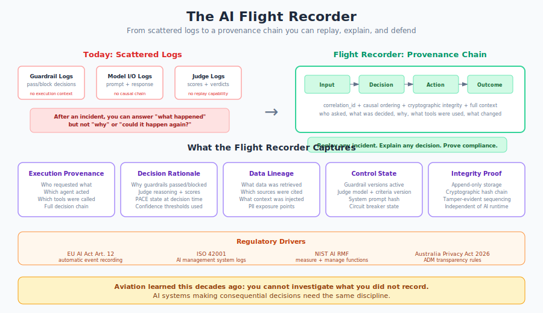

# The Flight Recorder Problem

**You log what happened. You don't record why, or how to replay it.**

{ .arch-diagram }

## The Analogy

Aviation solved this problem decades ago. After every crash, investigators needed more than wreckage. They needed a continuous, tamper-proof record of what the aircraft did, what the crew decided, and what the environment looked like at the time. The flight data recorder and cockpit voice recorder became mandatory. Not because regulators wanted paperwork, but because you cannot investigate what you did not record.

AI systems making consequential decisions face the same challenge. When something goes wrong, the first question is always "what happened?" The second, harder question is "why, and could it happen again?" Most AI logging answers the first. Almost none answer the second.

## What Logging Gets You Today

The framework's existing controls (LOG-01 through LOG-10, OB-1 through OB-3) provide strong foundations:

| Control | What It Captures | What It Misses |
|---------|-----------------|----------------|
| **LOG-01** Model I/O | Full prompt and response | Why the model chose this response over alternatives |
| **LOG-02** Guardrail decisions | Pass/block/modify with rationale | The state of other controls at decision time |
| **LOG-03** Judge evaluations | Scores, reasoning, verdict | Whether the same input would produce the same verdict tomorrow |
| **LOG-04** Agent actions | Tool calls, delegation, step sequence | The causal chain linking intent to outcome |
| **LOG-07** Log integrity | Append-only, tamper-evident | Cryptographic proof that the record is complete |

These are necessary. They are not sufficient. They give you a collection of facts, not a reconstructable narrative.

## The Gap: From Logs to Provenance

The difference between logging and a flight recorder is **provenance**: the ability to trace any outcome back through the complete causal chain that produced it, with enough context to replay the decision under the same conditions.

### What provenance requires that logging alone does not

**Causal ordering, not just timestamps.** Logs tell you event A happened at 14:23:01.456 and event B happened at 14:23:01.789. Provenance tells you event A *caused* event B. In multi-agent systems where agents operate concurrently, temporal ordering is insufficient. You need explicit causal links: this guardrail decision led to this model call, which triggered this tool invocation, which produced this output.

**Decision context, not just decisions.** Logging records that a guardrail passed an input. Provenance records *which version* of the guardrail was active, *what confidence threshold* was applied, *what the PACE state was*, and *which alternative actions were available*. Without this context, you cannot determine whether a control failure was a configuration error, a threshold miscalibration, or a genuine bypass.

**Replayability, not just record-keeping.** A flight data recorder lets investigators reconstruct the flight in a simulator. An AI flight recorder should let engineers reconstruct the decision chain: given the same input, the same model version, the same guardrail configuration, and the same context, would the system produce the same output? If yes, the issue is in the controls. If no, something has drifted.

**Completeness guarantees, not just best-effort capture.** Logs can have gaps. A flight recorder must be able to prove it captured everything. If a record is missing, that absence is itself a finding. Cryptographic hash chains (where each record includes a hash of the previous record) make gaps detectable.

## What the Flight Recorder Captures

Five categories of data, linked by a single correlation chain:

### 1. Execution Provenance

Who initiated the request. Which agent handled it. What delegation path was followed. What tools were invoked, with what parameters, and what they returned. The full decision chain from user intent to system action.

This extends LOG-04 (agent action logging) by requiring explicit causal links between steps, not just a sequential log of actions.

### 2. Decision Rationale

For every control point (guardrail, judge, policy engine, circuit breaker), the recorder captures not just the verdict but the reasoning: which rules matched, what confidence scores were produced, what thresholds were applied, and what the alternatives were.

This extends LOG-02 and LOG-03 by capturing the full decision context, not just the outcome.

### 3. Data Lineage

What data was retrieved (RAG sources, tool outputs, memory lookups). Which sources contributed to the response. What context was injected into the prompt. Where sensitive data appeared and how it was handled.

This is largely new ground. Most AI logging captures the final prompt sent to the model. Few capture the retrieval and assembly process that built that prompt.

### 4. Control State

A snapshot of the control environment at decision time: guardrail rule versions, judge model and criteria versions, system prompt hash, PACE state, circuit breaker state, active policy configurations.

This matters for forensics. If an incident occurred because a guardrail rule was temporarily disabled, the control state record proves it. Without it, you are guessing.

### 5. Integrity Proof

The recorder stores records in append-only, tamper-evident storage with cryptographic hash chaining. The recording system is architecturally independent of the AI runtime, so the system being recorded cannot modify its own record.

This builds on LOG-07 (log integrity) but elevates it from a property of the logging system to a core design principle of the recorder itself.

## Why Now

Three forces are converging to make this urgent.

### Regulatory mandates are becoming specific

The EU AI Act (Article 12) requires high-risk AI systems to "technically allow for the automatic recording of events (logs) over the lifetime of the system." This is not aspirational language. It carries penalties of up to EUR 35 million or 7% of global turnover. The compliance deadline is August 2026.

Australia's Privacy Act reforms (effective December 2026) specifically target automated decision-making transparency, requiring organisations to explain when and how algorithms affect individuals.

South Korea's Basic AI Act (January 2026) mandates transparency, risk assessment, and documentation for high-impact AI systems, with extraterritorial reach.

Colorado's AI Act, Texas's RAIGA, and California's S.B. 53 all introduce documentation and transparency requirements at the state level in the US.

These are not suggestions. They are enforceable obligations with teeth.

### Agentic AI makes the problem harder

Single-model systems produce a prompt and a response. The forensic surface is small. Agentic systems produce branching decision chains across multiple models, tools, and data sources. An agent that autonomously calls five tools, delegates to two sub-agents, and makes ten intermediate decisions before producing a final output creates a forensic surface that scattered logs cannot reconstruct.

The [orchestrator problem](the-orchestrator-problem.md) compounds this: the most powerful agents in your system are often the least observable.

### Emerging standards are defining the shape

The Verifiable AI Provenance (VAP) framework defines cryptographically verifiable decision provenance for high-risk AI systems. Georgia Tech's ZEN framework (presented at NDSS 2026) addresses model-level provenance, verifying whether AI models contain hidden flaws or are repackaged versions of other systems. Harvard's Berkman Klein Center published "Inside the Black Box," introducing interpretability dashboards that reveal how AI systems form internal assumptions about users.

These are early, but they signal where the field is heading: from "log what you can" to "prove what happened."

## Mapping to Existing Controls

The flight recorder is not a replacement for existing logging. It is an architectural pattern that unifies and extends what LOG-01 through LOG-10 and OB-1 through OB-3 already capture.

| Existing Control | What It Provides | Flight Recorder Extension |
|-----------------|-----------------|--------------------------|
| LOG-01 Model I/O | Input/output capture | Add control state snapshot and causal links |
| LOG-02 Guardrail decisions | Verdict + rationale | Add rule version, threshold, PACE state, alternatives |
| LOG-03 Judge evaluations | Score + reasoning | Add criteria version, model version, reproducibility flag |
| LOG-04 Agent actions | Step-by-step trace | Add explicit causal ordering and delegation provenance |
| LOG-07 Integrity | Append-only storage | Add cryptographic hash chain and completeness proof |
| LOG-09 Redaction | PII removal | Add dual-layer: redacted operational + encrypted forensic copy |
| LOG-10 Correlation | SIEM integration | Add provenance-aware correlation (causal, not just temporal) |
| OB-1 Decision logging | What agents decided | Add why, under what constraints, with what alternatives |
| OB-2 Anomaly scoring | Drift detection | Add baseline snapshots to the recorder for comparison |

## Practical Architecture

The flight recorder sits alongside (not in front of) the runtime pipeline. It observes, it does not block. This is critical: the recorder must never add latency to the decision path or become a single point of failure for the AI system.

**Core properties:**

- **Write-only from the runtime's perspective.** The AI system emits events. The recorder ingests them. The AI system cannot read, modify, or delete recorded events.
- **Append-only, hash-chained storage.** Each record includes a hash of the previous record. Gaps and modifications are detectable.
- **Separate failure domain.** The recorder runs on independent infrastructure. A failure in the AI runtime does not compromise the recording. A failure in the recorder does not stop the AI system.
- **Dual-layer retention.** Redacted records for operational use (accessible to the team). Encrypted, unredacted records for forensic investigation (dual-approval access, time-limited).
- **Queryable by correlation chain.** Given any event (a blocked request, a flagged output, an escalated decision), you can retrieve the complete provenance chain in causal order.

## The Forensic Workflow

When an incident occurs, the flight recorder enables a structured forensic process:

**1. Identify the event.** Start with the flagged output, the customer complaint, or the control alert.

**2. Retrieve the provenance chain.** Pull the complete causal chain for the correlation ID: every input, decision, action, and output that contributed to the incident.

**3. Inspect the control state.** What guardrail versions were active? What judge criteria were applied? Was the system in a degraded PACE state? Were any controls temporarily disabled?

**4. Test for reproducibility.** Given the same input, model version, and control configuration, does the system produce the same output? If yes, the controls need updating. If no, investigate what drifted.

**5. Determine blast radius.** Query the recorder for other interactions during the same period with the same control configuration. Were other users affected? How many decisions were made under the same conditions?

**6. Produce the evidence package.** For regulators, auditors, or legal proceedings: a verifiable, tamper-evident record of exactly what happened, why, and what has been done to prevent recurrence.

## What This Doesn't Solve

Honesty requires acknowledging limits.

**Reasoning model opacity.** Models with hidden chain-of-thought (like o1 or o3) produce reasoning traces that are not fully exposed to the caller. The recorder can capture the visible input and output, but not the internal reasoning process. This is a [known gap](when-ai-thinks.md) that recorder architecture alone cannot close.

**Streaming pre-delivery.** In streaming deployments, tokens reach the user before the full response can be evaluated. The recorder captures the complete response after the fact, but it cannot prevent harm from tokens already delivered. This intersects with the [streaming controls](../core/streaming-controls.md) challenge.

**Cost at scale.** Comprehensive provenance recording generates significantly more data than traditional logging. For high-throughput systems, storage and query infrastructure costs are non-trivial. Risk-tiered recording (full provenance for Tier 3+, reduced for Tier 1) is a pragmatic compromise.

**Retroactive coverage.** The recorder only captures what it is configured to observe. Interactions that occurred before the recorder was deployed, or that bypass the instrumented pipeline, will not be recorded. Discovery (the [visibility problem](the-visibility-problem.md)) remains a prerequisite.

## Key Takeaways

1. **Logging answers "what happened." A flight recorder answers "why, and could it happen again?"** The difference is provenance: causal ordering, decision context, replayability, and completeness guarantees.

2. **Regulation is making this mandatory, not optional.** The EU AI Act, Australia's Privacy Act reforms, South Korea's Basic AI Act, and multiple US state laws all require AI systems to maintain records sufficient for explanation and audit. Compliance deadlines fall in 2026.

3. **The existing control framework provides the foundations.** LOG-01 through LOG-10 and OB-1 through OB-3 capture the raw material. The flight recorder pattern unifies and extends these into a provenance chain.

4. **Agentic AI makes scattered logs insufficient.** Multi-agent decision chains require causal provenance, not just timestamped event logs. Without it, incident reconstruction for complex agentic workflows is guesswork.

5. **The recorder observes, it does not block.** It sits alongside the runtime pipeline, adds no latency to the decision path, and operates on independent infrastructure. Recording failures must not become AI system failures.

## Related

- [Logging & Observability Controls](../infrastructure/controls/logging-and-observability.md)
- [Telemetry & Audit (SDK)](../sdk/telemetry.md)
- [Runtime Telemetry Reference](../extensions/technical/runtime-telemetry-reference.md)
- [The Verification Gap](the-verification-gap.md)
- [The Orchestrator Problem](the-orchestrator-problem.md)
- [The Visibility Problem](the-visibility-problem.md)
- [When AI Thinks Before It Answers](when-ai-thinks.md)
- [AI Incident Playbook](../extensions/templates/ai-incident-playbook.md)

!!! info "References"
    - [EU AI Act Article 12: Record-Keeping](https://artificialintelligenceact.eu/)
    - [Australia Privacy Act 2026 ADM reforms](https://www.iispartners.com/insights/2026/01/29/from-black-box-to-transparency-the-privacy-acts-new-adm-rules)
    - [South Korea Basic AI Act](https://www.wsgr.com/en/insights/2026-year-in-preview-ai-regulatory-developments-for-companies-to-watch-out-for.html)
    - [VAP: Verifiable AI Provenance Framework](https://veritaschain.org/vap/)
    - [ZEN Framework (NDSS 2026)](https://techxplore.com/news/2026-03-ai-zen-framework-black.html)
    - [Inside the Black Box (Harvard Berkman Klein Center)](https://cyber.harvard.edu/publication/2025/inside-black-box)
    - [Colorado AI Act, Texas RAIGA, California S.B. 53](https://www.gunder.com/en/news-insights/insights/2026-ai-laws-update-key-regulations-and-practical-guidance)
    - [ISO/IEC 42001:2023](https://www.iso.org/standard/81230.html)
    - [NIST AI RMF](https://www.nist.gov/itl/ai-risk-management-framework)
