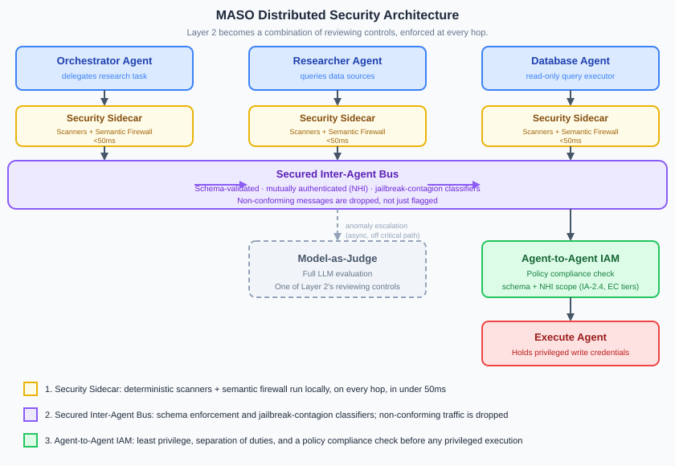

# Distributed Security Architecture

> Part of the [MASO (Multi-Agent Security Operations) Framework](README.md) · Architecture Pattern

## Principle

**At multi-agent scale, Layer 2 evaluation is not a single Model-as-Judge call. It is a combination of reviewing controls.**

[MASO's three-layer defence](README.md#three-layer-defence) specifies Layer 2 as a dedicated evaluation model that checks actions and inter-agent communications before they are committed. For a single agent, that model can sit on every action without becoming the bottleneck. For a mesh of agents handing tasks to each other, the number of evaluation points grows with every agent-to-agent hop, and one Judge cannot keep up.

The answer is not a faster Judge, and it is not skipping evaluation on the hops that need it. It is recognising that Layer 2 was always going to need more than one kind of control. Deterministic scanners, a semantic firewall, policy compliance checks, and Model-as-Judge each catch a different class of violation, at a different cost, and a distributed architecture lets each one run where it is the right tool: at the edge, on every hop or every privileged handoff, working together rather than queued behind each other.

{ .arch-diagram }

## The Token Death Spiral

[Disciplined MASO](../extensions/technical/token-economics.md#the-compounding-factor) already warns against putting a cloud Judge on every action. Multi-agent orchestration makes the same mistake worse, because the *number of boundaries* grows with every agent-to-agent hop.

Consider a single user request that an orchestrator decomposes into a research task:

| Hop | Handoff | Naive placement | Added latency | Added cost |
|-----|---------|-----------------|---------------|------------|
| 1 | Orchestrator delegates to Researcher | Cloud Judge evaluates the delegation | 1.2-3s | $0.01-0.05 |
| 2 | Researcher queries Database Agent | Cloud Judge evaluates the query | 1.2-3s | $0.01-0.05 |
| 3 | Database Agent returns results | Cloud Judge evaluates the response | 1.2-3s | $0.01-0.05 |
| 4 | Researcher returns findings to Orchestrator | Cloud Judge evaluates the handoff | 1.2-3s | $0.01-0.05 |

One user request now costs 4 Judge calls: 5-12 seconds of added latency and $0.04-0.20 of added token spend, before the orchestrator has produced anything. At fleet scale this is the same demand-side curve described in [Token Management as a Runtime Security Control](../extensions/technical/token-economics.md#token-management-as-a-runtime-security-control): every additional agent-to-agent hop multiplies the Judge's contribution to context fill, queue depth, and shared-GPU contention. The control meant to keep the system safe becomes the reason it falls over.

This sharpens two evolution vectors from [MASO 2.0 Anticipated Changes](maso-2.0-anticipated-changes.md): the **Judge Ceiling** (vector 1, where Judge cost and latency stop scaling with primary model capability) and **Multi-Agent Emergent Behaviours** (vector 4, where per-hop evaluation cannot keep pace with fleet-level interaction). It is also the architectural answer the [Judge Proliferation Review](reviews/stakeholder-review-judge-proliferation.md) calls for when it says the tactical judge should be "infrastructure, not a service."

The fix is the one described above: stop treating Layer 2 as a single model's job, and push the combination of reviewing controls down to where each hop actually happens.

## 1. Reviewing Controls at the Edge: The Security Sidecar

Before Agent A's output is allowed to reach Agent B, it passes through Agent A's local **security sidecar**: the same [distilled SLM sidecar](../extensions/technical/distill-judge-slm.md) pattern already specified for tool-call evaluation, applied to every agent-to-agent handoff.

The sidecar is not one model doing one job, and it is not a pre-filter sitting in front of a Judge. It runs the combination of reviewing controls described above, each suited to a different failure mode:

### Deterministic Scanners

Schema validation, regex pattern blocking, secret-pattern detection (cross-referencing [IA-2.6](controls/identity-and-access.md)), and size/rate limits. These run in microseconds, need no model at all, and catch the majority of malformed or out-of-policy payloads before anything more expensive looks at them.

### Semantic Firewall

A narrow model, the same family as the [distilled SLM](../extensions/technical/distill-judge-slm.md), trained specifically to recognise prompt-injection and jailbreak patterns in the payload by their meaning rather than their surface form. This is the "domain-specific" half of the sidecar trilemma table: a generalist cloud Judge misses the patterns this semantic firewall was built to catch, and catches them in 15-30ms rather than 1-3s.

### Three Reviewing Controls, Working Together

Each check returns **GO**, **NO-GO**, or **ESCALATE**. GO and NO-GO are resolved locally, in under 50ms, by the scanner or semantic firewall alone, each acting as a reviewing control in its own right rather than a gatekeeper for the next. ESCALATE is how Model-as-Judge joins the combination: for the cases the scanners and semantic firewall cannot resolve, and even then asynchronously wherever the [risk classification](controls/objective-intent.md) for the action permits it. Only HIGH and CRITICAL actions hold the pipeline for a synchronous Judge call, exactly as the [Critical-Path Latency](../extensions/technical/cost-and-latency.md#critical-path-latency-for-time-sensitive-workflows) model already specifies.

| Reviewing control | Latency | Runs on | Handles |
|--------------------|---------|---------|---------|
| Deterministic scanners | <5ms | Every hop | Schema violations, secrets, malformed payloads |
| Semantic firewall | 15-30ms | Every hop | Prompt injection, jailbreak patterns |
| Model-as-Judge | 1.2-3s (async) / held (sync, HIGH+) | Escalations only | Novel or ambiguous violations |

None of these controls is a pre-filter for the others. Each resolves the class of violation it is best suited to, at the cost appropriate to that class. Section 3 adds the fourth: a **policy compliance check** for the privileged handoffs that need one.

## 2. Securing the Inter-Agent Bus

The [Secure Inter-Agent Message Bus](README.md#three-layer-defence) is already MASO's mandatory channel for agent-to-agent traffic, with mutual authentication via NHI certificates ([IA-2.3](controls/identity-and-access.md)). The bus carries two additional, mesh-level jobs that sit alongside the per-agent sidecars rather than replacing them.

### Schema Enforcement

[PG-1.4](controls/prompt-goal-and-epistemic-integrity.md) already requires inter-agent messages to carry a `{type: "data" | "instruction" | "claim"}` tag. The bus enforces this as a hard gate: if an agent that is supposed to emit structured, typed messages suddenly starts emitting free-form natural language, the bus drops the connection rather than forwarding a degraded message. A schema violation on the bus is treated as a compromise indicator, not a formatting bug, the same posture [ET-20](maso-2.0-anticipated-changes.md#2026-q2-threat-driven-additions) recommends for steganographic agent-to-agent channels: canonicalise to a typed intent representation, and treat any reversion to free text as suspicious.

### Jailbreak Contagion Detection

An attacker rarely targets the privileged Execution Agent directly. They compromise the public-facing Researcher Agent and use *it* to carry a malicious payload inward. The per-agent sidecar (Section 1) is tuned to that agent's own normal traffic and may not recognise a payload crafted to look like a legitimate handoff. A second, bus-level classifier (same purpose-built model family, deployed centrally rather than per-agent) watches the aggregate traffic for the signature of "jailbreak contagion": a payload that reads as benign to the sending agent's sidecar but carries injected instructions for the receiving agent. This is [EP-03 (hallucination amplification)](controls/prompt-goal-and-epistemic-integrity.md) and [ASI01/ASI07](README.md#owasp-top-10-for-agentic-applications-2026) viewed as a propagation problem rather than a single-hop one.

| Bus control | Extends | Failure mode it catches |
|--------------|---------|--------------------------|
| Schema enforcement, drop on violation | [PG-1.4](controls/prompt-goal-and-epistemic-integrity.md), [ET-20](maso-2.0-anticipated-changes.md#2026-q2-threat-driven-additions) | Compromised agent reverting to free-text instructions |
| Mutual authentication (NHI) | [IA-2.3](controls/identity-and-access.md) | Spoofed agent identity on the bus |
| Jailbreak-contagion classifier | [ASI01/ASI07](README.md#owasp-top-10-for-agentic-applications-2026), [EP-03](controls/prompt-goal-and-epistemic-integrity.md) | Injection passed from a compromised agent to a downstream peer |

## 3. Agent-to-Agent IAM: Action Gating

[Identity & Access](controls/identity-and-access.md) already requires that delegated tasks do not inherit the delegating agent's permissions ([IA-2.4](controls/identity-and-access.md)) and that delegation carries a signed mandate at Tier 3 ([IA-3.3](controls/identity-and-access.md)). The pattern that ties these together is **action gating**, Layer 2's fourth reviewing control: a **policy compliance check** that runs not on every hop, but on every privileged handoff.

### Separation of Duties

No single agent in the mesh holds both broad read access and privileged write credentials. A concrete split:

- A **Read Agent** (for example, the email-triage agent in our hop example) holds a wide but read-only NHI scope. It can be compromised by a poisoned inbound message without that compromise translating into a transaction.
- An **Execute Agent** holds the narrow, privileged credentials, for example the API keys for the banking core. It accepts no inbound natural language at all.

This is [ET-18 (NHI sprawl)](maso-2.0-anticipated-changes.md#2026-q2-threat-driven-additions) applied structurally: every agent spawned for a task gets an ephemeral, scoped credential with parent-child lineage, and the Execute Agent's credential is never in scope for any agent upstream of it.

### Gating the Handoff

If the Read Agent determines a transaction is needed, it cannot call the privileged tool itself. It constructs a formal, schema-typed action request (the same typed representation the bus enforces in Section 2) and passes it to the Execute Agent. The Execute Agent's own sidecar (Section 1) runs the policy compliance check: it validates the request's structure and scope against the Execute Agent's [OISpec](controls/objective-intent.md) and the [action classification rules](controls/execution-control.md#action-classification-rules-tier-2) for that action's risk tier, *before* the underlying tool is ever invoked. The Execute Agent does not reason about whether the request is a good idea; it checks whether the request is one it is structurally permitted to fulfil.

| Action gating element | Extends | Role |
|------------------------|---------|------|
| Separation of duties (Read Agent / Execute Agent) | [ET-18](maso-2.0-anticipated-changes.md#2026-q2-threat-driven-additions), [IA-2.5](controls/identity-and-access.md) | No single agent can complete an attack chain alone |
| Ephemeral, scoped NHI per agent | [IA-2.1](controls/identity-and-access.md), [IA-2.2](controls/identity-and-access.md) | Limits blast radius of a compromised Read Agent |
| Signed delegation mandate | [IA-3.3](controls/identity-and-access.md) | Defines the scope, limits, and expected output of the handoff |
| Policy compliance check (sidecar, before execution) | [Execution Control](controls/execution-control.md#action-classification-rules-tier-2) | Fourth reviewing control: structural check, independent of the requesting agent's reasoning |

## The Architectural Reality

Put together, the three patterns change where MASO's enforcement effort sits, not how much of it exists:

| Pattern | What runs at the edge, locally enforced | What remains a shared, central service |
|---------|--------------------------------------|-------------------------------------------|
| Security Sidecar | Deterministic scanners, semantic firewall (every hop) | Model-as-Judge, for escalations |
| Secured Inter-Agent Bus | Per-message authentication and schema enforcement | Aggregate jailbreak-contagion monitoring |
| Agent-to-Agent IAM | Policy compliance check, on every privileged handoff | Mandate issuance, revocation, and audit |

A Model-as-Judge between every agent-to-agent hop is a theoretical control: correct in principle, unworkable at the latency and cost a multi-agent fleet actually runs at. The fix is not to remove the Judge, it is to stop treating it as Layer 2's only control. Pushed to the edge as sidecars, a hardened bus, and Agent-to-Agent IAM, the combination of reviewing controls, deterministic scanners, a semantic firewall, a policy compliance check, and Model-as-Judge, run at machine speed and at the point where they are cheapest to enforce. Each does the part of the evaluation it is best at: scanners catch what is mechanically wrong, the semantic firewall catches what is adversarially shaped, the policy compliance check catches what a request has no authority to ask for, and the Judge catches what is genuinely novel.

This is the same "constrain regardless" principle from [MASO 2.0 Anticipated Changes](maso-2.0-anticipated-changes.md#the-deeper-architectural-question), applied one layer down: constrain the **handoff**, not just the **action**.

!!! info "References"
    - [MASO Framework](README.md)
    - [MASO 2.0 Anticipated Changes](maso-2.0-anticipated-changes.md)
    - [Judge Proliferation Review](reviews/stakeholder-review-judge-proliferation.md)
    - [Distilling the Judge into an SLM](../extensions/technical/distill-judge-slm.md)
    - [Identity & Access](controls/identity-and-access.md)
    - [Execution Control](controls/execution-control.md)
    - [Prompt, Goal & Epistemic Integrity](controls/prompt-goal-and-epistemic-integrity.md)
    - [Token Economics and MASO](../extensions/technical/token-economics.md)
    - [Cost & Latency](../extensions/technical/cost-and-latency.md)
